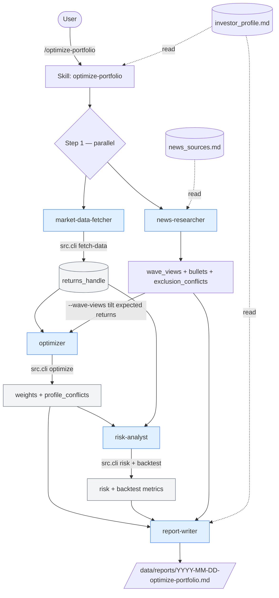

# Portfolio Wave Rider

A Claude Code demo of **skills + subagents** orchestrating a long-horizon
portfolio workflow against a user-authored profile. Skills are the
invocation surface; subagents are specialists with narrow tool
allowlists; all numbers come from Python via one CLI.

Audience: technical users new to skills/subagents.

## What it does

Three things, on three cadences:

| Cadence | Mechanism | What runs | Output |
|---|---|---|---|
| **Daily** (Mon–Fri 16:30 local) | macOS launchd | `python -m src.cli snapshot` — fetch close prices, compute $ values per holding | `data/snapshots.csv` (long format) |
| **Weekly** (Fri 17:00 local) | macOS launchd | `python -m src.cli recommend` — re-optimize over the holdings universe | `data/recommendations.csv` |
| **Monthly** (you decide) | You run `/rebalance` in Claude Code | Multi-agent: target weights → trade list with profile checks | `data/reports/YYYY-MM-DD-rebalance.md` |

Plus the flagship one-off: **`/optimize-portfolio`** — full multi-agent
run with live wave-stage classification from current news, written
report, profile conflict flags. Run this whenever you want a refreshed
narrative (the weekly cron is the lightweight Python-only sibling — no
news, no wave tilts).

## How it's built

- **Skills** (`.claude/skills/*/SKILL.md`) — slash commands you invoke:
  `/init-profile`, `/optimize-portfolio`, `/rebalance`. They orchestrate
  subagents and produce a markdown report.
- **Subagents** (`.claude/agents/*.md`) — specialists, each with their
  own context and tool allowlist:
  - `market-data-fetcher` — pulls prices, computes returns
  - `optimizer` — mean-variance solver, honors profile constraints
  - `risk-analyst` — Sharpe, vol, drawdown, VaR/CVaR + backtest
  - `news-researcher` — headlines per ticker; classifies wave stages
  - `report-writer` — synthesizes the final markdown
- **Python** (`src/portfolio.py` + `src/cli.py`) — all math in two
  files. Subagents invoke the CLI via Bash; LLMs never compute numbers.
- **Profile** (`investor_profile.md`) — the source of truth. Every
  agent reads it before recommending anything. When the optimal
  numerical answer violates a constraint, the report **flags the
  conflict** rather than silently clamping. That's the demo's punchline.

The flagship `/optimize-portfolio` flow:



Subagents (blue) are LLM specialists; they call the Python CLI for every
number. Files in grey are the artifacts that flow between steps. The
profile and `news_sources.md` are read-only inputs.

## Initial setup

```bash
python3.12 -m venv .venv
source .venv/bin/activate
pip install -e ".[dev]"

# Inside Claude Code, write your profile (one-time interview):
> /init-profile
```

Then edit two files:

- **`investor_profile.md`** — goals, risk tolerance, concentration cap,
  exclusions, asset-class targets. Every recommendation cites lines from
  this file.
- **`holdings.csv`** — `ticker,shares` for everything you want tracked.
  Set `shares` to 0 for tickers you're watching but don't yet own; the
  daily snapshot still logs prices, so you have history when you buy in.

Optional: `news_sources.md` (curated sources per technology wave —
improves the news-researcher's signal; missing is fine, falls back to
open search).

## Daily / weekly / monthly: what you do

- **Daily** — nothing. The launchd job appends a row per ticker to
  `data/snapshots.csv` at 16:30 local. Glance at `data/snapshot.log` if
  something looks wrong.
- **Weekly** — nothing. Friday 17:00 local appends one optimization run
  to `data/recommendations.csv`. Inspect for trends (does the optimizer
  keep wanting more equities? gold weight rising?).
- **Monthly** — run `/rebalance` in Claude Code with your current
  holdings + a target. Read the report, decide, execute trades in your
  brokerage, then update `holdings.csv` to match.
- **As needed** — run `/optimize-portfolio` for a fresh wave-stage
  read from current news + a written report. This is the one to demo;
  it's also the one to consult when news has shifted materially.
- **When trading** — edit `holdings.csv` to reflect new share counts.
  The snapshot picks up the new positions on its next run.

## Outputs to monitor

| File | What's in it | When to look |
|---|---|---|
| `data/snapshots.csv` | Daily $ value per ticker + total | Plot to see portfolio trajectory |
| `data/recommendations.csv` | Weekly optimization weights + Sharpe | Plot to see weights drift |
| `data/reports/*.md` | Multi-agent narrative reports | After each `/optimize-portfolio` or `/rebalance` |
| `data/snapshot.log` / `data/recommend.log` | launchd stdout/stderr | If a scheduled run looks missing |

The **"Profile conflicts"** section of any report is the most important
thing to read — it tells you when the math wants something your profile
forbids.

## What to think about

- **The wave thesis vs. the optimizer.** Your profile probably says
  "aggressive, ride tech waves." Mean-variance over a 2–3 year window
  often prefers the safe-haven sleeve (bonds/gold/cash) because it had
  a smooth recent run. The conflict section will show this gap. You
  decide whether to override.
- **Sample bias.** The realized Sharpe on any 2–3 year window is
  usually optimistic vs. forward-looking reality. Watch the
  in-sample/out-of-sample degradation in the risk report.
- **Estimation error.** Mean-variance amplifies small errors in
  expected-return estimates. Heavy weight at the concentration cap is
  often a symptom, not signal.
- **Wave-stage tilts.** The full `/optimize-portfolio` skill applies
  multipliers (buildup 1.20x, surge 1.10x, peak 0.80x, etc.) based on
  the news-researcher's read. These tilts are conditional — track the
  realized vs. tilted Sharpe gap (the "views premium") to see if they
  pay.
- **The numbers come from Python.** If you ever see a figure in a
  report that didn't come from `src.cli`, that's a bug — flag it.

## CLI reference

```bash
# Data + optimization
.venv/bin/python -m src.cli fetch-data --tickers AAPL MSFT NVDA --period 3y
.venv/bin/python -m src.cli optimize   --returns-handle returns_1 --objective max_sharpe --max-weight 0.25
.venv/bin/python -m src.cli risk       --returns-handle returns_1 --weights '{"AAPL":0.5,"MSFT":0.5}'
.venv/bin/python -m src.cli backtest   --returns-handle returns_1 --weights weights.json

# Time-series logging (the cron jobs call these)
.venv/bin/python -m src.cli snapshot   [--date YYYY-MM-DD] [--force]
.venv/bin/python -m src.cli recommend  [--max-weight 0.25] [--force]
```

## launchd management

```bash
launchctl list | grep portfolio                              # status
launchctl start com.user.portfolio-snapshot                  # run snapshot now
launchctl start com.user.portfolio-recommend                 # run recommend now
launchctl unload ~/Library/LaunchAgents/com.user.portfolio-snapshot.plist   # disable
```

Plists live at `~/Library/LaunchAgents/com.user.portfolio-{snapshot,recommend}.plist`.
launchd runs only while logged in; if your Mac is asleep at trigger
time the job runs on wake; if powered off the run is missed (use
`--date YYYY-MM-DD` to backfill).

## Layout

```
portfolio-wave_rider/
├── investor_profile.md      # your north star (you write this)
├── holdings.csv             # ticker,shares (you maintain this)
├── news_sources.md          # optional curated sources per wave
├── CLAUDE.md                # rules for Claude operating in this repo
├── .claude/
│   ├── agents/              # 5 subagent specs
│   ├── skills/              # 3 skills
│   └── settings.json        # tool allowlist
├── src/
│   ├── portfolio.py         # all math
│   └── cli.py               # one CLI, all subcommands
├── tests/
└── data/                    # gitignored
    ├── snapshots.csv        # daily, appended
    ├── recommendations.csv  # weekly, appended
    ├── reports/             # multi-agent reports
    ├── state/               # pickle handles between Python processes
    └── *.log                # launchd output
```

## Testing

```bash
.venv/bin/pytest tests/    # offline; no network, no API
```

## Extending it

- New math → add a function to `src/portfolio.py` and a subcommand to
  `src/cli.py`.
- New specialist → add `.claude/agents/<name>.md`.
- New workflow → add `.claude/skills/<name>/SKILL.md`.

## Disclaimer

Technical demo. Not financial advice. Historical performance is not
predictive. Don't trade real money on this output without independent
verification.

## License

MIT.
