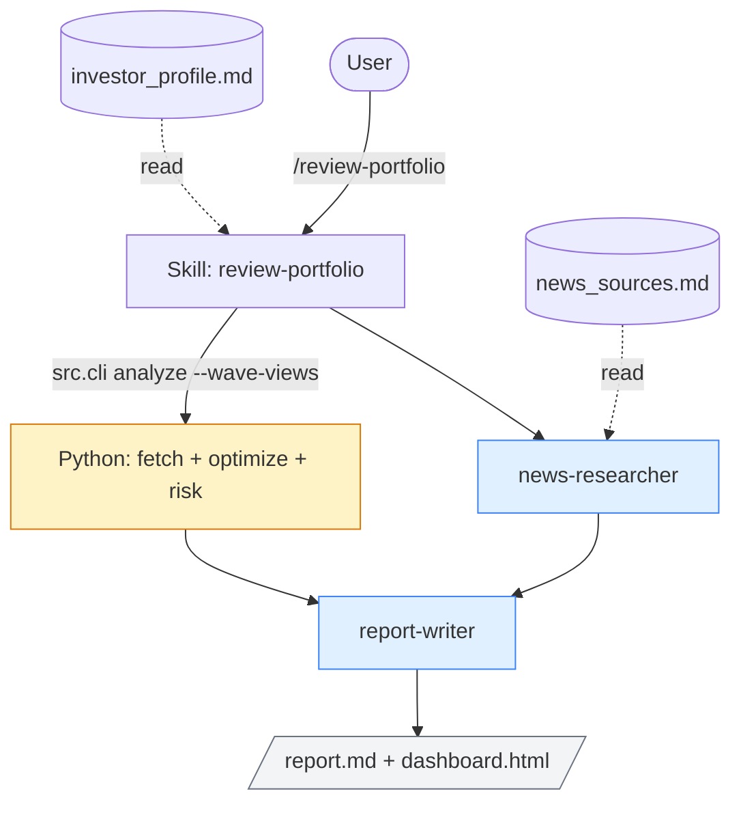

# Portfolio Wave Rider

**Author:** Joe Hahn  
**Email:** jmh.datasciences@gmail.com  
**Date:** 2026-May-02 <br>
**branch:** main

A Claude Code demo: optimize a long-horizon portfolio of stocks and ETFs against a user-authored investor profile. Two slash commands, two LLM subagents, five Python CLI subcommands, and a static dashboard. Stack: yfinance for prices, scipy.optimize for the QP solver, pandas for everything in between, Plotly for the dashboard.

## Glossary (skip if you do this for a living)

This README leans on a handful of finance terms. For a data-science reader they map cleanly onto familiar math.

**Symbols used below:**
- `r` = return (typically a daily log return); `E[r]` = expected (mean) return.
- `σ` = standard deviation of returns (a.k.a. **volatility**).
- `μ` = vector of expected returns, one entry per asset (one of the optimizer's two inputs).
- `Σ` = covariance matrix of returns (the optimizer's other input).
- `w` = vector of portfolio weights, one entry per asset. Constrained: `Σw_i = 1` (fully invested) and each `w_i ≥ 0` (long-only).
- `V_t` = cumulative portfolio value at time `t`.
- `cummax(V)_t` = the running max of `V` through time `t`. Same semantics as pandas' `Series.cummax()`.
- `α` = quantile level (e.g., `α = 0.05` picks out the 5% tail of the return distribution).

| Term | Plain definition |
|---|---|
| **Ticker** | Symbol identifying a security: `AAPL` is Apple, `AGG` is an aggregate bond ETF, `IBIT` is a spot-Bitcoin ETF. |
| **ETF** | Exchange-traded fund. A packaged basket of underlying securities that trades like a single stock. |
| **Long-only** | All portfolio weights `w_i ≥ 0`. No short selling, no leverage. |
| **Mean-variance optimization** | Markowitz framework. Convex quadratic program: pick weights `w` that minimize `wᵀΣw` (variance) subject to `wᵀμ = target` (target return) and `Σw = 1`, `w ≥ 0`. We use `scipy.optimize.minimize(SLSQP)`. |
| **Risk-free rate (`r_free`)** | The return you can earn with effectively zero risk by parking money in short-term US Treasuries or a money-market fund. Default in the code is `0.04` (4% annualized, roughly a 1-year Treasury yield). Adjustable via `--risk-free-rate` on `analyze` and `recommend`. |
| **Sharpe ratio** | Signal-to-noise on returns: `(E[r] − r_free) / σ`. The numerator is the **excess return** (return above what's free). The denominator is the standard deviation of returns. You only get credit for the risk-bearing part of `E[r]`. Higher is better; values above 1 are good for a long-horizon portfolio. |
| **Max drawdown** | Worst observed peak-to-trough decline of cumulative value: `min_t (V_t − cummax(V)_t) / cummax(V)_t`. A max drawdown of `-0.30` means at some point the portfolio lost 30% from a prior high. |
| **VaR_α** | Value-at-risk: the α-quantile of the daily return distribution. `VaR_0.05 = -0.02` means there's a 5% chance of losing more than 2% on a given day (under the empirical distribution). |
| **CVaR_α** | Conditional VaR: the expected return conditioned on being below `VaR_α`. Tail-loss expectation. |
| **Concentration cap** | Box constraint on the optimizer: `w_i ≤ max_weight` for every asset. Profile default 0.25. |
| **Asset class** | Coarse bucket: equities, bonds, precious metals, cash, cryptocurrencies. |
| **Asset-class drift** | Deviation of recommended weights summed by class from the user's declared target percentages. Reported but not enforced. |
| **Wave-stage tilt** | Multiplicative scaling on `μ` (the expected-return vector) before optimization. `μ_tilted[i] = stage_multiplier × μ[i]`. The five stages and their multipliers are in `src/portfolio.py:WAVE_STAGE_TILT`. |
| **Rebalance** | Execute trades to move current portfolio weights back toward target weights. This project produces recommendations; the user does the trading. |
| **Wave thesis** | The user's belief that long technology waves drive returns: enter early in a wave (buildup, surge), trim near the crest (peak), avoid the hangover (digestion). The profile prose names the current wave (AI) and the next ones (robotics, rockets/spacecraft, nuclear fusion, quantum computing). |

## What it does

Three cadences:

| Cadence | Mechanism | What runs | Output |
|---|---|---|---|
| Daily, Mon-Fri 16:30 local | cron | `snapshot && dashboard`. Fetches the latest close price for every ticker in `holdings.csv`, multiplies by `shares`, appends one row per ticker to `data/snapshots.csv`. Then refreshes the dashboard. | `data/snapshots.csv`, `data/dashboard.html` |
| Weekly, Fri 17:00 local | cron | `recommend && dashboard`. Re-runs the mean-variance optimizer over the holdings universe, appends new target weights to `data/recommendations.csv`, refreshes the dashboard. No news, no wave tilts. | `data/recommendations.csv`, `data/dashboard.html` |
| Monthly, you decide | You run `/review-portfolio` in Claude Code | LLM subagents gather wave-aligned news, classify each wave's stage, pass `wave_views` to the optimizer (which scales `μ` accordingly), then write a profile-aware report and refresh the dashboard. | `data/reports/YYYY-MM-DD-review-portfolio.md`, `data/dashboard.html` |

The weekly cron is the lightweight Python-only sibling of `/review-portfolio`: pure Python, no LLM, no wave tilts. Run the skill when you want a fresh wave-stage read and a written narrative.

## How it's built

- Two skills at `.claude/skills/`:
  - `/initialize-portfolio`: one-time day 0 setup. Translates the user's wave thesis into an initial dollar allocation across the watchlist. Pre-math.
  - `/review-portfolio`: monthly review. Mean-variance optimization with wave-stage tilts plus a written report.
- Two subagents at `.claude/agents/`:
  - `news-researcher`: picks wave-aligned news per ticker (web search scoped to `news_sources.md` first, open search as fallback), classifies each wave's stage, returns a `wave_views` mapping `{ticker: stage}`.
  - `report-writer`: synthesizes the analysis and news into the final markdown report.
- All Python in two files: `src/portfolio.py` (math) and `src/cli.py` (one entry point with five subcommands).
- The user-authored `investor_profile.md` is the source of truth. Every recommendation cites lines from it. When the optimal numerical answer violates a profile constraint, the report flags the conflict; it does not silently clamp.



Two LLM specialists (blue) bracket one Python call (yellow). The profile and `news_sources.md` are read-only inputs.

## Setup

```bash
python3.12 -m venv .venv
source .venv/bin/activate
pip install -e ".[dev]"

# Copy templates and edit:
cp investor_profile.example.md investor_profile.md
cp holdings.example.csv holdings.csv
```

The two files you maintain:

- `investor_profile.md`: `initial_investment_usd`, `concentration_cap`, `exclusions`, `asset_class_targets`, and the wave-thesis prose. Every recommendation cites lines from this file.
- `holdings.csv`: a two-column CSV (`ticker,shares`) acting as your watchlist. Pre-day-0 you can leave every `shares` at 0; that's the universe `/initialize-portfolio` will allocate dollars across.

Optional: `news_sources.md`, a curated list of sources per technology wave. Improves the news-researcher's signal. Missing is fine; the agent falls back to open web search.

### Day 0: thesis-driven allocation

In Claude Code, run:

```
/initialize-portfolio
```

The skill reads the profile, proposes a thesis-driven dollar allocation across the watchlist (no math, just the wave thesis plus asset-class targets), converts dollars to shares using current prices (`shares = dollars / price`), overwrites `holdings.csv`, records day 0 via `snapshot`, and writes `data/reports/YYYY-MM-DD-initialize-portfolio.md`. This is the user's beliefs in dollar form. Think of it as a strong prior.

### Day 1: optimized allocation

Run:

```
/review-portfolio
```

This runs the mean-variance optimizer with wave-stage tilts and writes a report. The first run after `/initialize-portfolio` produces what we call the day 1 distribution. The gap between day 0 and day 1 is the marginal contribution of the optimizer relative to the user's stated beliefs: how much does formal mean-variance with current data move you off your prior?

## Operations

- Daily: nothing. The cron job appends a row per ticker to `data/snapshots.csv` and refreshes `data/dashboard.html`.
- Weekly: nothing. Friday 17:00 local appends one optimization run to `data/recommendations.csv` and refreshes the dashboard.
- Monthly: run `/review-portfolio` in Claude Code. Read the report, decide on rebalances, execute trades in your brokerage, then update `holdings.csv`.
- Anytime: open `data/dashboard.html` in a browser.
- After trading: edit `holdings.csv` to reflect new share counts. The next snapshot picks up the new positions.

## Outputs to monitor

| File | What's in it | When to look |
|---|---|---|
| `data/dashboard.html` | Three Plotly charts: portfolio value over time (long-format snapshots aggregated to a daily total), per-ticker recommended-weight trajectories, and the latest weights as a bar chart | Open in a browser any time |
| `data/snapshots.csv` | Long-format daily snapshots: `date, ticker, shares, price, value, total_value` | Raw history; load with pandas |
| `data/recommendations.csv` | Long-format weekly optimizer output: `date, ticker, weight, expected_return, annual_volatility, sharpe_ratio, objective` | Raw history; load with pandas |
| `data/reports/*.md` | LLM-written narrative reports, one per `/review-portfolio` run | After each `/review-portfolio` |
| `data/snapshot.log`, `data/recommend.log` | cron stdout/stderr | If a scheduled run looks missing |

The "Profile conflicts" section of any report is the most important thing to read. It tells you when the optimizer wanted something the profile forbids.

## Things to watch

- **Prior vs likelihood.** The wave thesis is a prior; mean-variance over a 2-3 year price window is a likelihood. The optimizer often disagrees with the prior because the recent past favored low-volatility assets (bonds, cash, gold). The "Profile conflicts" section shows where they disagree. The user decides which to trust.
- **Sample bias.** The realized Sharpe on any 2-3 year window is usually optimistic vs the forward-looking distribution. Returns are non-stationary; vol clusters; means are noisy.
- **Estimation error in `μ`.** Mean-variance amplifies small errors in the expected-return estimate. A weight pinned at the concentration cap is often a symptom of estimation noise, not a real signal. This is the well-known Markowitz blow-up.
- **Wave-stage tilts.** Multipliers are deliberately small and symmetric: 1.20 / 1.10 / 1.00 / 0.90 / 0.80. The tilt nudges the optimizer; it does not dictate. Track the realized vs tilted Sharpe gap (the "views premium") to see whether the news-researcher's classifications add information.
- **Numbers come from Python.** If a figure in a report did not come from `src.cli`, that's a bug. The LLM is allowed to write prose; it is not allowed to do arithmetic.

## CLI reference

Five subcommands. `/initialize-portfolio` calls `init-holdings`. `/review-portfolio` calls `analyze`. The cron jobs call the other three. Every subcommand prints a single JSON blob to stdout.

```bash
# Day 0: convert a thesis-driven dollar allocation into shares
.venv/bin/python -m src.cli init-holdings --allocations '{"NVDA": 5000, "MSFT": 5000, ...}' --out holdings.csv

# Day 1: one-shot analysis (fetch prices + compute log-returns + optimize + risk metrics)
.venv/bin/python -m src.cli analyze --tickers AAPL MSFT NVDA --period 3y --max-weight 0.25

# Time-series logging
.venv/bin/python -m src.cli snapshot   [--date YYYY-MM-DD] [--force]
.venv/bin/python -m src.cli recommend  [--max-weight 0.25] [--force]

# Static dashboard (reads the two CSVs above; writes data/dashboard.html)
.venv/bin/python -m src.cli dashboard
```

## cron setup

Two cron entries cover the daily and weekly automation. Works on macOS and Linux:

```cron
PROJ=/path/to/portfolio-wave-rider
# Daily snapshot + dashboard refresh, Mon-Fri 16:30 local
30 16 * * 1-5  cd $PROJ && .venv/bin/python -m src.cli snapshot && .venv/bin/python -m src.cli dashboard >> data/snapshot.log 2>&1
# Weekly recommend + dashboard refresh, Fri 17:00 local
0  17 * * 5    cd $PROJ && .venv/bin/python -m src.cli recommend && .venv/bin/python -m src.cli dashboard >> data/recommend.log 2>&1
```

Install with `crontab -e` and paste. Adjust `PROJ` to your clone path. Verify with `crontab -l`. cron only fires while the machine is awake; missed runs do not auto-replay. Use `--date YYYY-MM-DD` on either subcommand to backfill.

## Layout

```
portfolio-wave-rider/
├── investor_profile.md         # source of truth (you write this; gitignored)
├── investor_profile.example.md # template to copy
├── holdings.csv                # ticker,shares (you maintain this; gitignored)
├── holdings.example.csv        # template to copy
├── news_sources.md             # optional curated sources per wave
├── CLAUDE.md                   # rules for Claude operating in this repo
├── .claude/
│   ├── agents/                 # 2 subagent specs (news-researcher, report-writer)
│   ├── skills/                 # 2 skills (initialize-portfolio, review-portfolio)
│   └── settings.json           # tool allowlist
├── src/
│   ├── portfolio.py            # all math
│   └── cli.py                  # one CLI, five subcommands
├── tests/
└── data/
    ├── snapshots.csv           # daily, appended (your history)
    ├── recommendations.csv     # weekly, appended (your history)
    ├── dashboard.html          # static Plotly dashboard (gitignored, regenerated)
    ├── reports/                # LLM-written reports (gitignored)
    └── *.log                   # cron output (gitignored)
```

## Testing

```bash
.venv/bin/pytest tests/    # offline; no network calls, no API keys needed
```

Tests are pure-Python: synthetic price series → returns → optimizer → risk metrics. Network-dependent code paths (yfinance) are not exercised in CI.

## Notes

This project was developed with [Claude Code](https://claude.com/claude-code). See `CLAUDE.md` for the rules Claude follows when operating in this repo.

## Disclaimer

Technical demo. Not financial advice. Historical performance is not predictive. Do not trade real money on this output without independent verification.

## License

MIT.
