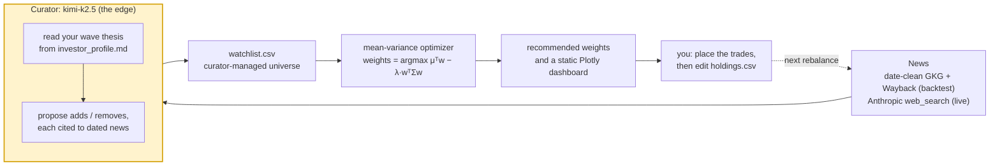

# Portfolio Wave Rider

**Author:** Joe Hahn  
**Email:** jmh.datasciences@gmail.com  
**Date:** 2026-May-14 <br>
**branch:** main <br>
**License:** [PolyForm Noncommercial 1.0.0](LICENSE.md), free for noncommercial use; [commercial rights reserved](#license)

This project uses AI to manage a curated watchlist of tickers. You declare your goals, constraints, and an investment thesis (what you think will drive future returns), then initialize a starter watchlist you want exposure to. This solution's two halves have a deliberate division of labor. The **curator** is AI-powered, and it is forward-looking: at each rebalance it reads recent news against your thesis and evolves the watchlist, hunting tickers in the early buildup of a wave that may rise soon and preferring the news sources you trust. The **optimizer** is strictly backward-looking: an industry standard math-only mean-variance model that sets the weights from trailing returns and covariances, pure math, no AI. So the AI decides *which* tickers the optimizer may choose among, and the math decides the weights. The results accumulate into dashboards where you can watch the watchlist composition, the recommended weights, and the realized portfolio value evolve over time, and monitor how realized gains are attributed to the news sources, authors, keywords, and waves behind each pick. In our experiments this coupling of AI curation with standard optimization significantly outperforms the optimizer on its own.

**Who this helps.** An investor who has a thesis about where markets are going but not enough time to track the news, or who wants help optimizing a portfolio. This demo helps that investor move from a static buy-and-hold portfolio to one that is lightly but effectively managed by AI. In the 3-year backtest below (2023 to 2026) the AI-managed portfolio outperforms a buy-and-hold of the starter watchlist by a wide margin. The curator's job is to compound a thesis you already hold, not to invent one you don't.

**The dashboards.** The results are served from GitHub Pages in three families, each running the same retriever-then-curator pipeline on a different slice of time.

*Backtest* (the historical GDELT-GKG plus Wayback replay, 2023 to 2026):

- **[Retriever, RBT](https://joehahn.github.io/portfolio-wave-rider/retrieval_pwr.html)**: the date-clean GKG plus Wayback news corpus the backtest curator reads, with coverage, sources, and per-window article counts. Mechanical, no LLM.
- **[Curator, CBT](https://joehahn.github.io/portfolio-wave-rider/backtest_gkg_3yr_kimi.html)**: the curator's watchlist decisions replayed over the window, portfolio value against buy-and-hold and SPY, the watchlist Gantt, and per-wave profit and loss.
- **[Sweeps](https://joehahn.github.io/portfolio-wave-rider/sweep_pwr.html)**: a zero-cost sweep of the optimizer knobs (cap, `λ`, lookback), a curator-LLM comparison, and a blind, leak-free judge that scores each curator's reasoning with the market outcome hidden.

*Bootstrap* (a recent backtest tail stitched to ongoing daily forward ingests, so the curve keeps extending in real time):

- **[Retriever, RBS](https://joehahn.github.io/portfolio-wave-rider/retrieval_bootstrap.html)**: the bootstrap's news corpus, the backtest tail plus the daily live ingests that carry it forward.
- **[Curator, CBS](https://joehahn.github.io/portfolio-wave-rider/curator_bootstrap.html)**: the curator seeded from the latest backtest recommendation, then carried forward biweekly on fresh news, its equity curve extending as new snapshots land.

*Forwardtest* (the live, genuinely out-of-sample test):

- **[Dashboard, FT](https://joehahn.github.io/portfolio-wave-rider/forward_dashboard.html)**: the live portfolio, value against SPY, the current allocation, and the trades needed to align with the latest optimizer recommendation.

## How it works, at a glance

Each rebalance runs one loop. The curator is the only judgment call; everything else is deterministic Python.


```mermaid
flowchart LR
    N["News<br/>date-clean GKG + Wayback (backtest)<br/>Anthropic web_search (live)"]
    subgraph CUR["Curator: kimi-k2.5 (the edge)"]
      direction TB
      A["read your wave thesis<br/>from investor_profile.md"] --> B["propose adds / removes,<br/>each cited to dated news"]
    end
    N --> CUR
    CUR --> W["watchlist.csv<br/>curator-managed universe"]
    W --> O["mean-variance optimizer<br/>weights = argmax μᵀw − λ·wᵀΣw"]
    O --> D["recommended weights<br/>and a static Plotly dashboard"]
    D --> U["you: place the trades,<br/>then edit holdings.csv"]
    U -. next rebalance .-> N
    style CUR fill:#fff3cd,stroke:#d39e00,stroke-width:2px
```

The highlighted box is where the advantage comes from: an LLM reading the news against your thesis to decide *which tickers* the optimizer gets to choose among. The optimizer only ever sets the weights.

See [GLOSSARY.md](GLOSSARY.md) for the meanings of the finance terms used below (`σ`, `μ`, `Σ`, Sharpe ratio, risk aversion `λ`, mean-variance optimization, etc.) and [REFERENCE.md](REFERENCE.md) for project details (repo layout, code, input and output files, architecture overview, and testing instructions).

## Recent revisions

The project has evolved since its first release, and the dashboards above reflect the current design.

- **Clean news retrieval.** The backtest curator no longer reads news via live WebSearch, which leaks present-day knowledge into historical queries (a 2023 rebalance would surface 2026 "best stocks to buy" lists). It now reads a date-honest **GDELT-GKG plus Wayback** corpus: server-enforced date bounds and archived same-date article ledes, so each rebalance only sees news that existed at that time. This removes the *retrieval* leak. It does not remove the model's training-memorization leak, so only forward testing can settle that (more in the caveats).
- **A cheap, disciplined default curator.** Every backtest return is in-sample and cannot rank one curator LLM against another, so a **blind, leak-free rationale judge** scores the reasoning instead: an independent Opus grader rates each add and remove with the market outcome hidden. It found **kimi-k2.5** ties Sonnet on reasoning quality while running about 8x cheaper and 3x faster, so kimi is now the default backtest curator.
- **One unified sweep.** The four separate sweep pages are retired in favor of a single [parameter-sweep dashboard](https://joehahn.github.io/portfolio-wave-rider/sweep_pwr.html): the zero-cost optimizer-knob frontier, the curator-LLM comparison, and the blind judge, side by side.
- **Skills retired, plain Python in.** The Claude-Code *skills* (the slash commands) are gone. Every routine run is now plain Python: the CLI (`python -m src.cli`) plus a few scripts, calling the OpenRouter and Anthropic SDKs directly for the curator. So the backtest and the forward path share one curator prompt, retriever, validator, and optimizer, a lesson learned on either side lands on the other, and routine runs cost an API key rather than Claude-Code tokens (those are spent only during development). Setup below covers the API keys.

The granular numbers (exact config, per-wave attribution, the full bias accounting) live in [REFERENCE.md](REFERENCE.md); this page keeps the visitor-level tour.

## Setup

Install dependencies, edit the configuration files to your taste, bootstrap your initial portfolio, and install the daily cron job.

### 1. Install dependencies

```bash
python3.12 -m venv .venv
source .venv/bin/activate
pip install -e ".[dev]"

# Copy templates:
cp investor_profile.example.md investor_profile.md
cp holdings.example.csv holdings.csv
```

API keys go in a `.env` file rather than your shell profile, covered in step 2 below.

### 2. Configure the input files

Everything you configure lives in six files at the repo root. The first four are personal and gitignored (they never reach GitHub); the last two ship with the repo and are tracked, so edits to them are public.

| File | Tracked | What you put in it |
|---|---|---|
| `investor_profile.md` | no | Goals, wave thesis, exclusions, and every optimizer and curator knob |
| `holdings.csv` | no | Your real positions, `ticker,shares` |
| `.env` | no | API keys |
| `gcp-key.json` | no | Google BigQuery service-account credentials, needed only to rebuild the backtest news corpus |
| `news_sources.md` | yes | Which news domains to trust, block, and treat as specialty desks |
| `gkg_config.json` | yes | The backtest retriever's per-wave search keywords |

- **`investor_profile.md`** is the source of truth for every recommendation: goals, constraints, sector exclusions, the wave-thesis prose the curator reasons against, and the YAML front matter holding all the numeric knobs (`initial_investment_usd`, `starter_watchlist`, `always_include` anchors, `financial_model` with risk aversion `λ`, risk-free rate, lookback and rebalance periods, concentration cap, and `max_watchlist_size`, plus the `backtest` and `forward` sections that pick each path's window and curator LLM). Nothing is hardcoded elsewhere, so this file alone changes behavior. Every recommendation cites lines from it.
- **`holdings.csv`** is a two-column CSV (`ticker,shares`) of your real positions. Start it empty (or with 0 shares); the one-time bootstrap (step 3) allocates dollars across your thesis tickers and writes both `holdings.csv` (real shares) and `watchlist.csv` (the curator-managed universe, a single `ticker` column). Thereafter you edit `holdings.csv` only when you actually trade; the biweekly review manages `watchlist.csv` for you, so that one is not a file you configure.
- **`news_sources.md`** ships pre-populated: a YAML `source_block` list of content-farm domains the retriever drops, a `source_major` list of wire services and major outlets (the ranker's mid-authority tier), and a prose section of specialty, wave-specific desks (the top tier, also read by the live curator). Tailor to your taste: add sources you trust, block ones that paywall heavily or go off-topic.
- **`gkg_config.json`** drives the historical (GDELT-GKG) retriever: `wave_keywords` maps each wave to the phrases matched against article URLs and titles, `org_stoplist` drops non-company entities, and `engine` holds two mechanical guards (`ontopic_offset`, `max_scan_gb`, a BigQuery cost cap). Adding a wave to `investor_profile.md` is picked up automatically by the live path but **not** here: the backtest needs matching keywords added, then a re-ingest, since the keyword regex is what BigQuery is queried with.

### 2a. API keys

All keys live in a single **`.env` file at the repo root**, gitignored and never committed. One `KEY=value` per line, no quotes and no `export` prefix (the readers in `src/curator.py`, `src/retriever.py`, `scripts/backtest_sdk.py`, and `scripts/judge_curations.py` are plain line parsers, so both would be read as part of the value):

```
OPENROUTER_API_KEY=...     # every non-Claude curator model, e.g. the kimi-k2.5 backtest default
ANTHROPIC_API_KEY=...      # every claude-* model: the live sonnet curator, the haiku news pull, the blind judge
```

Which key a run needs follows from the model named in `investor_profile.md`: a model id starting with `claude` routes through the Anthropic SDK and needs the Anthropic key, anything of the form `vendor/model` routes through OpenRouter. So a backtest replay at the kimi default needs only the OpenRouter key, while the live forward loop (a `claude-sonnet-5` curator and an Anthropic `web_search` news pull) needs only the Anthropic key. Pure math runs, meaning the optimizer, the snapshots, and every dashboard refresh, call no LLM and need no key at all.

Google credentials work differently: **`gcp-key.json`**, a BigQuery service-account key file, is read from the repo root by path (`scripts/gkg_pool.py`), not through the usual `GOOGLE_APPLICATION_CREDENTIALS` environment variable. It is needed only when rebuilding the backtest news corpus from GDELT-GKG, not for any routine run.

Nothing reads keys from the shell environment, so cron inherits nothing and needs no export line. Rotating a key means editing the one value in `.env`. Both `.env` and `gcp-key.json` are listed in `.gitignore` under "personal data, never push".

### 3. Bootstrap the portfolio

Bootstrap the portfolio once: turn your wave thesis and starter watchlist into a concrete day-0 dollar allocation per ticker (beliefs in dollar form, no optimizer yet), convert those dollars to share counts with `.venv/bin/python -m src.cli init-holdings`, and save the allocation as `data/thesis_baseline.json`, the baseline every future review compares against.

### 4. Install the cron jobs (required)

Open your crontab:

```bash
crontab -e
```

and add the following, editing the `PWR_path` line just once to your actual repository path:

```
# portfolio-wave-rider: set the repo path once; all jobs below reuse it
PWR_path=/path/to/portfolio-wave-rider
# Forward news pull into the corpus, every day incl. weekends, 18:30 local (evening, after the US close)
30 18 * * *  $PWR_path/scripts/news_pull.sh
# Weekday price snapshot + dashboard + Curator Bootstrap refresh, Mon-Fri 16:30 local
30 16 * * 1-5  $PWR_path/scripts/price_snapshot.sh
# Biweekly curation review + report (self-gated by rebalance_period), Mon-Fri 19:00 local
0 19 * * 1-5  $PWR_path/scripts/review_curation.sh
```

Verify with `crontab -l`. Works the same on macOS and Linux, and leaves any other crontab entries untouched. cron makes the `PWR_path` variable available to every command below it, so it must appear before the job lines. The scripts ship executable, so no `chmod` is needed.

- **Daily at 18:30 local** (`news_pull.sh`, every day including weekends): the forward news pull. It runs your wave queries through Anthropic web_search and appends the raw articles to the frozen corpus under `data/forward_corpus/`. The evening slot (a few hours after the US close) captures the full day including after-hours earnings and evening coverage, freezing each article near its publication date, which keeps the corpus clean for later forward testing.
- **Weekday at 16:30 local** (`price_snapshot.sh`, Mon to Fri): the price snapshot plus three render-only dashboard refreshes. It snapshots per-ticker prices into `data/snapshots.csv` (well after the 16:00 ET close, so the daily close is final), then regenerates three dashboards off that fresh snapshot: `docs/index.html` (the live page), the Curator Bootstrap (CBS) equity curve via `refresh_cbs.py`, and the Forwardtest (FT) dashboard via `build_forward_dashboard.py` (value vs SPY, current allocation, and the trades to align with the latest optimizer recommendation). All three run in this one job because they read the same-day snapshot; none makes an LLM call.
- **Weekday at 19:00 local** (`review_curation.sh`, Mon to Fri): the self-gating rebalance review. It runs `review --if-due`, which curates the watchlist and writes a fresh recommendation report to `data/reports/` only when a full `rebalance_period` has elapsed since the last review (biweekly at present). The 19:00 slot is after the 18:30 news pull, so the curator reads same-day news; firing every weekday is safe because `--if-due` fires the actual curation only once per period and catches up a missed one on the next weekday. The cadence lives in `investor_profile.md`'s `rebalance_period`, so changing it needs no cron edit.

All jobs append timestamped output to `data/snapshot.log`, and all tolerate failures so a web_search or price hiccup never blocks the rest.

cron only fires while the machine is awake and does not replay missed runs. Backfill a missed price snapshot with `.venv/bin/python -m src.cli snapshot --date YYYY-MM-DD`. A missed news pull cannot be cleanly backfilled, because re-querying web_search about a past day reintroduces hindsight, so a laptop that sleeps through 18:30 leaves a gap in the corpus (recorded in the manifest at `data/forward_corpus/pulls.jsonl`).

To publish a refreshed dashboard to GitHub Pages: `git add docs/index.html && git commit -m "Refresh live dashboard" && git push`, since cron does not auto-push.

To uninstall: run `crontab -e` and delete the `PWR_path` line and the two `news_pull.sh` / `price_snapshot.sh` job lines.

## Runs

This project's portfolio-optimization activities.

### 1. initialize (once)

Bootstrap the portfolio once (Setup step 3): distribute your starting dollars across your thesis tickers using only the qualitative inputs in `investor_profile.md`, convert to shares with `.venv/bin/python -m src.cli init-holdings`, and write the "beliefs in dollar form" baseline to `data/thesis_baseline.json`.

### 2. cron to monitor ticker changes (daily)

Cron captures today's per-ticker shares and close price into `data/snapshots.csv` and updates the portfolio dashboard stored at `docs/index.html`.

### 3. update watchlist and optimize portfolio (monthly, quarterly, etc.)

The review runs on the biweekly cron (`review_curation.sh`, which calls `.venv/bin/python -m src.cli review --if-due`); you can also run it by hand with `.venv/bin/python -m src.cli review`. The cadence is `financial_model.rebalance_period` in `investor_profile.md` (`weekly` / `biweekly` / `monthly` / `quarterly`); `--if-due` self-gates to that period, so firing the cron every weekday is safe and it acts only once per period. The curator reads the trailing `news_lookback_days` of news against your wave thesis and proposes adds and removes against the current watchlist; the optimizer then recomputes weights across the updated watchlist; the report is written to `data/reports/<date>-review-portfolio.md`. Read it to see the curator's adds and removes this period and any conflicts where the optimizer wanted something your profile forbids.

Note that recommendations do not execute trades, they only append optimizer output to `data/recommendations.csv`. To act on a recommendation, execute trades in your brokerage and then edit `holdings.csv` so the next daily snapshot picks up the new share counts.

### 4. run the curator backtest (anytime)

Run the curator backtest with `scripts/backtest_sdk.py`. It builds the date-clean GKG plus Wayback news pool for each missing rebalance, evolves the watchlist rebalance by rebalance against your wave thesis via the curator LLM, optimizes the portfolio at each rebalance, measures the lift over a buy-and-hold strategy, and regenerates the dashboard at `docs/backtest_gkg_3yr_kimi.html`.

At each rebalance the curator reads the date-bounded news pool as of that date and proposes adds and removes, then the optimizer recomputes weights for whatever watchlist results, repeated across the window. Compare your run to ours at [our curator backtest dashboard](https://joehahn.github.io/portfolio-wave-rider/backtest_gkg_3yr_kimi.html), which shows the current lift over buy-and-hold and SPY, with the honest caveats spelled out below.

### 5. sweep the settings (anytime)

The four old per-parameter sweep pages are retired. Everything now lives on one [parameter-sweep dashboard](https://joehahn.github.io/portfolio-wave-rider/sweep_pwr.html), built by `scripts/build_sweep_dashboard.py`. It has three parts:

- **Optimizer-knob frontier.** The optimizer settings (`concentration_cap`, risk aversion `λ`, and the price lookback) only touch the mean-variance replay, not the curator, so the entire grid is a **zero-cost** local re-solve on a fixed set of curations. No LLM tokens, no news re-fetch. The dashboard ranks every config by Information Ratio and flags the current one.
- **Curator-LLM comparison.** Each candidate model reads the same news pools at the same config, so the only variable is the curator. This is where the cheap-workhorse choice (kimi) was made.
- **Blind rationale judge.** The leak-free scoring described in Recent revisions.

`max_watchlist_size` is swept separately, by re-curating at each size, because it shapes the curator's *decisions*, so each value needs its own set of curator calls rather than a free re-solve. See [REFERENCE.md](REFERENCE.md) for what each knob does and how the sweep is run.

## Acting on a recommendation

The review report ends with recommended weights, not trades. The project never touches your brokerage. To act on a recommendation:

1. Read the **Profile conflicts** and **Recommended allocation** sections of the report. The optimizer regularly produces concentrated calls (single-stock weights at the `concentration_cap`); decide which subset you actually want to execute.
2. Execute the buys and sells in your brokerage.
3. Edit `holdings.csv` with the new share counts to match your brokerage. (The curator manages `watchlist.csv`, never `holdings.csv`, so this file is yours alone to edit.)
4. The next daily cron snapshot picks up the new positions and the dashboard catches up.

You can also do nothing and let the next review produce a fresh recommendation. The split between recommendation and execution is intentional so you can review, override, or ignore each call.

## How `holdings.csv` and `watchlist.csv` shape outcomes

Two files describe the portfolio, with a clean split of ownership:

- **`holdings.csv`** (`ticker,shares`) is what you *actually own* — real positions, `shares > 0`. **You edit it, and only you**, after executing trades in your brokerage; the curator/cron never writes it. It drives the snapshots, current allocation, and the "sell/current" side of trade recommendations.
- **`watchlist.csv`** (single `ticker` column) is the *curator-managed universe* — the tickers the optimizer may assign weight to. The biweekly review auto-adds and auto-removes here; you normally do not touch it.

The optimizer's universe is **`watchlist.csv` ∪ (the tickers you hold in `holdings.csv`) ∪ the profile's `always_include` anchors**. Consequences:

- **Optimizer eligibility.** The optimizer can only weight tickers in that union.
- **Dropping a held ticker is safe.** If the curator removes a ticker from `watchlist.csv` while you still hold it, it stays in the universe (via the union with `holdings.csv`) so the optimizer can recommend *selling* it; it leaves the universe only once you sell it out of `holdings.csv`. No more "liquidate first" dance.
- **Anchors** (e.g. SPY/AGG/IAU) come from the profile's `always_include`, sit outside `max_watchlist_size`, and are never in `watchlist.csv`; the curator cannot add or remove them.
- **Audit trail.** Every applied watchlist change is logged to `data/curation_history.csv`.
- **Manual edits.** Put a ticker on the curator's radar by appending it to `watchlist.csv`; record a real trade by editing `holdings.csv`.

## How the pieces fit: Python plus one LLM curator

The split is deliberate. Python does everything deterministic; an LLM does the one judgment call.

- **Deterministic work is Python.** Portfolio optimization, price fetching, payload validation, the news retriever, and dashboard rendering all live in [`src/portfolio.py`](src/portfolio.py) and [`src/cli.py`](src/cli.py). You run them through the CLI (`python -m src.cli <subcommand>`) and a few thin cron scripts. There are no Claude-Code skills or subagents anymore.
- **The one judgment call is an LLM.** Deciding which news matters and which tickers to add or remove is the piece that resists fixed logic, so it goes to an LLM curator: kimi-k2.5, called through the OpenRouter SDK. The same curator prompt and validator serve both the backtest and the forward path, so a lesson learned on either side lands on the other.

Each part stays small and reads at a glance. Anything that must persist between runs is a file under `data/`.

## How the watchlist-curator works

The curator decides which tickers belong on the watchlist. Its job is composition only: read the news, decide what to add and remove against the current watchlist. It never proposes weights or forecasts; it manages the set of tickers the optimizer may choose among, informed by current news and aligned with your thesis. In the backtest it is kimi-k2.5 reading the date-clean GKG pool; the live path fires the same curator on the biweekly cron review (`cli review --if-due`).

On each call the curator:

1. Reads the wave thesis from `investor_profile.md` and the current watchlist from `watchlist.csv`.
2. Reads the recent-news pool for that date: the GKG plus Wayback pool in the backtest, an Anthropic web_search pull live, preferring the sources in `news_sources.md`.
3. Proposes adds and removes, bounded by the free slots in `max_watchlist_size`, each cited to dated news.
4. Returns one JSON payload.

Python then validates the payload: US-listed only, listing-date check via yfinance, post-change watchlist size within `max_watchlist_size`, no double-adds, no stale removes. Only the changes that survive touch `watchlist.csv`; your real positions in `holdings.csv` are never modified. The curator prompt and parser live in [`src/curator.py`](src/curator.py).

## How the optimizer works

The optimizer used here selects a portfolio that maximizes the mean-variance objective function:

```
μᵀw − λ·wᵀΣw
```

subject to ∑ᵢ wᵢ = 1 (weights sum to one) and 0 ≤ wᵢ ≤ concentration_cap. The first term `μᵀw` is the portfolio's expected return (the weighted average of per-ticker expected returns); the second term `wᵀΣw` is the portfolio's return variance, scaled by `λ` to act as a risk penalty. `μ` is the per-ticker expected-return vector, computed as the annualized mean of daily log returns over a trailing price-history window (`optimizer_lookback_days`, set in `investor_profile.md`). `Σ` is the ticker × ticker covariance matrix estimated over the same window. `w` is the weight vector the optimizer is solving for. `λ` (risk aversion) trades expected return against variance:

- `λ → 0`: the solution favors high-return tickers, which also tend to have greater variability.
- Intermediate `λ`: leans toward higher-reward tickers while keeping a real variance penalty. The live value is set in `investor_profile.md` under `financial_model.risk_aversion`, chosen with the parameter sweep rather than hardcoded here (it moves as the strategy is tuned).
- `λ ≫ 1`: the variance penalty dominates, so the solution tends toward a low-variance portfolio that is heavy in cash and bonds.

This is the standard Markowitz mean-variance formulation (Markowitz 1952, *Portfolio Selection*, Journal of Finance 7:77-91), which is the textbook starting point for portfolio construction because it captures the central return-vs-risk tradeoff in a single closed-form quadratic expression. See [GLOSSARY.md](GLOSSARY.md) for the full definitions.

## Main findings

This project reads business news against a user's stated investment thesis, derives a curated watchlist from it, and hands that watchlist to a standard mean-variance optimizer for weighting at each rebalance. The AI's job is watchlist composition only; the financial model turns the watchlist into weights. The published backtest runs biweekly across 2023 to 2026 from an equal-weight `[AAPL, GOOGL, AMZN]` buy-and-hold investor who is too busy to track the news and revise the portfolio. We know such investors exist because the author is one.

The curator (kimi-k2.5 reading the date-clean GKG pool) is disciplined: it swaps rarely, every ticker real and US-listed, and holds the line the rest of the time, rotating into a next-wave name only on a concrete catalyst. The optimizer then concentrates into whatever is running. The AI-managed book beats the busy investor's buy-and-hold by a wide margin over the window. The exact returns move whenever the config or thesis is tuned, so this page does not hardcode them; the current figures are on the [curator-backtest dashboard](https://joehahn.github.io/portfolio-wave-rider/backtest_gkg_3yr_kimi.html).

**Where the lift comes from, and why to distrust it.** Most of the gain typically rides on a single dominant position. That is the headline and the caveat at once: it is one favorable wave the curator caught and held, not a broad-based edge, and a single winning bet (n=1) cannot separate skill from luck. Worse, the whole result is in-sample. The clean GKG plus Wayback retriever removes the *retrieval* leak, so the curator only ever saw period-correct news, but the curator is an LLM whose training postdates the window, so it may simply remember which 2023-to-2026 names won. The backtest is therefore a hindsight-tinted upper bound, not a clean out-of-sample result. The only honest test is **forward testing**: hold the config fixed and measure realized performance on quarters that postdate the model's training cutoff. That is the next phase of this project.

See the [curator backtest dashboard](https://joehahn.github.io/portfolio-wave-rider/backtest_gkg_3yr_kimi.html) for the current figures, and [REFERENCE.md](REFERENCE.md) for the config, the per-wave attribution, the safe-haven-anchor accounting, and the full bias discussion.

## Notes

This project was developed with [Claude Code](https://claude.com/claude-code). See `CLAUDE.md` for the rules Claude follows when operating in this repo. CLI flags, repo layout, output files, architecture overview, and testing instructions live in [REFERENCE.md](REFERENCE.md). Finance and stats terms are defined in [GLOSSARY.md](GLOSSARY.md).

## Disclaimer

Technical demo. Not financial advice. Historical performance is not predictive. Do not trade real money on this output without independent verification.

## License

[PolyForm Noncommercial License 1.0.0](LICENSE.md), effective 2026-07-30. Free to use, modify, and share for any noncommercial purpose: research, experimentation, education, personal projects, and use by nonprofit or government organizations. Commercial use is not granted by this license.

Commercial rights are reserved by the author. If you want to use this work commercially, email jmh.datasciences@gmail.com and we will talk.

This project was released under MIT before 2026-07-30. That grant is irrevocable for the commits it covered, so anything published under it stays MIT in those versions; the terms above govern this commit onward.
