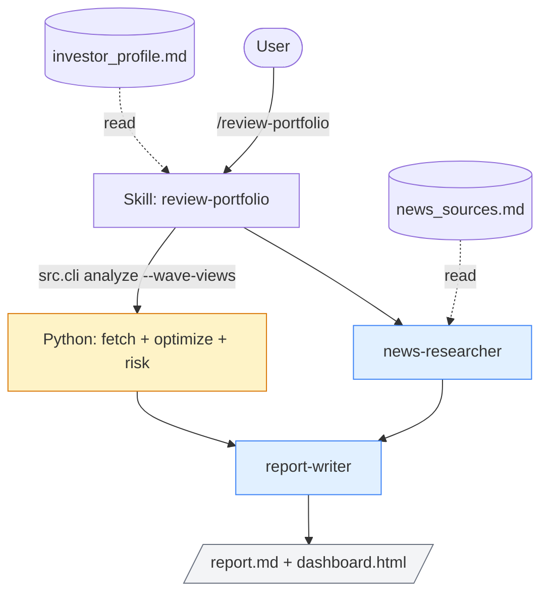

# Reference

CLI flags, repo layout, and testing instructions for Portfolio Wave Rider. Narrative tour and operational guide live in [README.md](README.md); finance terms in [GLOSSARY.md](GLOSSARY.md).

## CLI reference

Eight subcommands. `/review-portfolio` calls `init-holdings` (first-run branch only), `wave-history` (after each news pass), `analyze`, `recommend`, and `dashboard`. The daily cron calls `snapshot` and `dashboard`. `backtest` is a one-off spot-check tool, not part of any cron flow. `seed-wave-history` is a one-time backfill for the wave-stage trajectory chart (chart 5). Every subcommand prints a single JSON blob to stdout.

```bash
# Convert a thesis-driven dollar allocation into shares (used internally by the
# initialize-portfolio skill; runnable directly if you ever want to redo a thesis
# allocation, e.g. after expanding the watchlist)
.venv/bin/python -m src.cli init-holdings --allocations '{"NVDA": 5000, "MSFT": 5000, ...}' --out holdings.csv

# Append today's per-wave stage classifications (read from data/news_latest.json)
# to data/wave_history.csv so the dashboard can plot stage trajectories
.venv/bin/python -m src.cli wave-history [--news data/news_latest.json] [--force]

# Backfill 12 months of post-hoc monthly wave-stage classifications, tagged
# seeded=True. Run once on a fresh repo so chart 5 (wave-stage trajectories) is
# informative before /review-portfolio has had time to accumulate organic history.
.venv/bin/python -m src.cli seed-wave-history [--force]

# One-shot analysis (fetch prices + compute log-returns + optimize + risk metrics).
# Three objectives:
#   max_sharpe    - default; maximize (μᵀw - r_free) / √(wᵀΣw). Risk-adjusted optimum.
#   min_variance  - minimize wᵀΣw. Lowest-vol point on the frontier.
#   mean_variance - maximize μᵀw - λ·wᵀΣw. λ (`--risk-aversion`) slides along the
#                   frontier: small λ favors return (more equity-heavy), large λ
#                   favors variance reduction (more bond/cash-heavy).
.venv/bin/python -m src.cli analyze --tickers AAPL MSFT NVDA --period 1.3y --max-weight 0.25
.venv/bin/python -m src.cli analyze --tickers AAPL MSFT NVDA --objective mean_variance --risk-aversion 1.0

# Time-series logging
.venv/bin/python -m src.cli snapshot   [--date YYYY-MM-DD] [--force]
.venv/bin/python -m src.cli recommend  [--max-weight 0.25] [--force]

# Walk-forward backtest of the 'recommend' path over a historical window
# (math-only; no LLM cost at the math layer). Writes data/backtest/{snapshots,
# recommendations}.csv plus data/backtest/report.md with realized return, max
# drawdown, weight stability, and per-benchmark active-return comparison
# (default SPY). Default window is a rolling 12 months ending today (yfinance silently clips to whatever trading day has data, so a mid-session run just stops at yesterday's close). Auto-renders
# both data/backtest/dashboard.html and docs/backtest.html.
.venv/bin/python -m src.cli backtest [--start-date YYYY-MM-DD] [--end-date YYYY-MM-DD] [--initial-usd 50000] [--benchmarks SPY DIA QQQ]

# Same backtest with the mean_variance objective at lambda=1 — wave-thesis-heavy
# (more equity weight) at the cost of variance reduction.
.venv/bin/python -m src.cli backtest --objective mean_variance --risk-aversion 1.0

# Same backtest with time-varying wave-stage tilts: at each monthly rebalance,
# the optimizer looks up the most recent classification at-or-before that
# Friday from wave_history.csv and applies the stage multiplier to mu.
.venv/bin/python -m src.cli backtest --wave-history data/wave_history.csv

# Static dashboard (reads the CSVs above plus both news files; writes
# docs/index.html by default; overlays each --benchmarks ticker on the
# portfolio-value chart, default SPY). Pass --nav-current to prepend the
# cross-page nav strip used by docs/index.html and docs/backtest.html.
.venv/bin/python -m src.cli dashboard [--benchmarks SPY] [--out docs/index.html] [--nav-current live|backtest|lambda|max_weight]
```

To inspect the backtest visually without auto-render, point the dashboard at the backtest CSVs:

```bash
.venv/bin/python -m src.cli dashboard \
  --snapshots data/backtest/snapshots.csv \
  --recommendations data/backtest/recommendations.csv \
  --out data/backtest/dashboard.html
```

## Layout

```
portfolio-wave-rider/
├── investor_profile.md         # source of truth (you write this; gitignored)
├── investor_profile.example.md # template to copy
├── holdings.csv                # ticker,shares (you maintain this; gitignored)
├── holdings.example.csv        # template to copy
├── news_sources.md             # optional curated sources per wave
├── README.md                   # narrative tour + operations
├── REFERENCE.md                # this file: CLI, layout, testing
├── GLOSSARY.md                 # finance and stats terms
├── CLAUDE.md                   # rules for Claude operating in this repo
├── .claude/
│   ├── agents/                 # 2 subagent specs (news-researcher, report-writer)
│   ├── skills/                 # 3 skills (initialize-portfolio, review-portfolio, run-backtest)
│   └── settings.json           # tool allowlist
├── src/
│   ├── portfolio.py            # all math
│   └── cli.py                  # one CLI, nine subcommands
├── tests/
├── data/
│   ├── snapshots.csv           # daily, appended (your history; gitignored)
│   ├── recommendations.csv     # appended on each /review-portfolio (your history; gitignored)
│   ├── wave_history.csv        # per-/review-portfolio run, appended (gitignored)
│   ├── thesis_baseline.json    # one-time artifact from /initialize-portfolio (gitignored)
│   ├── news_feed.json          # daily yfinance headlines (gitignored)
│   ├── news_latest.json        # latest news payload from /review-portfolio (gitignored)
│   ├── news/                   # archived news payloads, one per run (gitignored)
│   ├── reports/                # LLM-written reports (gitignored)
│   ├── backtest/               # output of `cli backtest` runs (gitignored)
│   └── *.log                   # cron output (gitignored)
└── docs/                       # GitHub Pages publishing root
    ├── index.html              # public live dashboard
    ├── backtest.html           # public 12-month backtest dashboard
    ├── lambda_comparison.html  # mean_variance λ sweep
    ├── max_weight_comparison.html  # concentration_cap sweep
    ├── news.html               # news bullets that drove the latest wave-stage classifications
    └── wave-stage-classification.md  # consolidated doc on wave-stage pipeline
```

## Outputs

| File | What's in it | When to look |
|---|---|---|
| `docs/index.html` | Eight Plotly charts of the live portfolio. Same file GitHub Pages serves. | Open in a browser any time |
| `docs/news.html` | Wave-stage news bullets from the latest `/review-portfolio` run, grouped by wave bucket — the evidence the news-researcher used to classify each wave's stage. | After each `/review-portfolio` |
| `data/wave_history.csv` | Per-wave stage classifications over time. Drives chart 5 (wave-stage trajectory). | Raw wave-classification history |
| `data/news/YYYY-MM-DD-news.json` | Full archived news payload per `/review-portfolio` run (~25 KB each). | Forensic re-read after a stage shift |
| `data/snapshots.csv` | Long-format daily snapshots (date, ticker, shares, price, value, total_value). | Raw price/share history |
| `data/recommendations.csv` | Long-format optimizer output (date, ticker, weight, return, vol, Sharpe, objective). One row block per `/review-portfolio` run. | Raw weight history |
| `data/reports/*.md` | LLM-written narrative reports, one per `/review-portfolio` run. | After each `/review-portfolio` |
| `data/snapshot.log` | cron stdout/stderr. | If a scheduled run looks missing |

The "Profile conflicts" section of any report is the most important thing to read. It tells you when the optimizer wanted something the profile forbids.

## How it's built

- Three skills at `.claude/skills/`:
  - `initialize-portfolio` (one-shot): reads the profile and an empty holdings.csv, produces a thesis-driven dollar allocation, persists it to `data/thesis_baseline.json`, and writes a thesis-only report.
  - `review-portfolio` (recurring): reads the profile, holdings, and (if present) the thesis baseline; gathers news, runs the optimizer with wave-stage tilts, writes a profile-aware report, refreshes the live dashboard. Renders the thesis-vs-recommended comparison on every run when the baseline exists.
  - `run-backtest` (on demand): walk-forward 12-month backtest, auto-rendering both the local and public backtest dashboards.
- Two subagents at `.claude/agents/`:
  - `news-researcher`: picks wave-aligned news per ticker (web search scoped to `news_sources.md` first, open search as fallback), classifies each wave's stage, returns a `wave_views` mapping `{ticker: stage}`.
  - `report-writer`: synthesizes the analysis and news into the final markdown report.
- All Python in two files: `src/portfolio.py` (math) and `src/cli.py` (one entry point with eight subcommands).
- The user-authored `investor_profile.md` is the source of truth. Every recommendation cites lines from it. When the optimal numerical answer violates a profile constraint, the report flags the conflict; it does not silently clamp.



Two LLM specialists (blue) bracket one Python call (yellow). The profile and `news_sources.md` are read-only inputs.

## Testing

```bash
.venv/bin/pytest tests/    # offline; no network calls, no API keys needed
```

Tests are pure-Python: synthetic price series → returns → optimizer → risk metrics. Network-dependent code paths (yfinance) are not exercised in CI.
