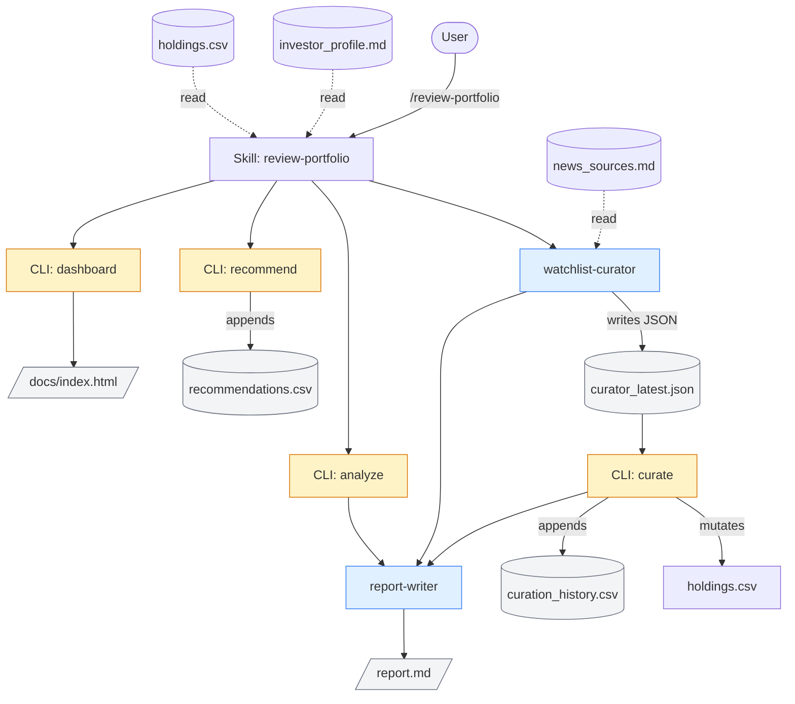

# Reference

CLI flags, repo layout, architecture, and testing instructions for Portfolio Wave Rider. Narrative tour lives in [README.md](README.md); finance terms in [GLOSSARY.md](GLOSSARY.md).

## CLI reference

Seven subcommands. The daily cron calls `snapshot` and `dashboard`. The `/review-portfolio` skill calls `curate`, `analyze`, `recommend`, and `dashboard`. `backtest` is a one-off spot-check tool. Every subcommand prints a single JSON blob to stdout.

```bash
# Convert a thesis-driven dollar allocation into shares (used internally by the
# initialize-portfolio skill; runnable directly if you ever want to redo a thesis
# allocation, e.g. after expanding the watchlist).
.venv/bin/python -m src.cli init-holdings --allocations '{"NVDA": 5000, "MSFT": 5000, ...}' --out holdings.csv

# One-shot analysis (fetch prices + compute log-returns + optimize + risk metrics).
# The optimizer always maximizes the mean-variance utility μᵀw - λ·wᵀΣw subject
# to ∑wᵢ=1, wᵢ≥0, and wᵢ≤max_weight. λ (`--risk-aversion`) is the only knob on
# the return/variance tradeoff: small λ favors return (more equity-heavy), large
# λ favors variance reduction (more bond/cash-heavy).
.venv/bin/python -m src.cli analyze --tickers AAPL MSFT NVDA --period 1.5y --max-weight 0.70
.venv/bin/python -m src.cli analyze --tickers AAPL MSFT NVDA --risk-aversion 0.5

# Apply a watchlist-curator JSON payload to holdings.csv and data/curation_history.csv.
# Validates against the contract (listing date via yfinance, max_watchlist_size,
# no double-adds, no stale removes, blocks removes when shares > 0). Output JSON
# lists applied_adds, applied_removes, and rejections with reasons.
.venv/bin/python -m src.cli curate --input data/curator_latest.json [--as-of-date YYYY-MM-DD] [--no-listing-check]

# Time-series logging
.venv/bin/python -m src.cli snapshot   [--date YYYY-MM-DD] [--force]
.venv/bin/python -m src.cli recommend  [--max-weight 0.70] [--force]

# Math-only walk-forward backtest of a fixed watchlist. Default window is a rolling
# 12 months ending today (yfinance silently clips to whatever trading day has data).
# Writes data/backtest/{snapshots, recommendations}.csv plus report.md to data/backtest/.
.venv/bin/python -m src.cli backtest [--start-date YYYY-MM-DD] [--end-date YYYY-MM-DD] \
                                     [--initial-usd 50000] [--benchmarks SPY DIA QQQ]

# Curator-driven walk-forward backtest: same as above but consumes a directory of
# pre-collected watchlist-curator JSON payloads (one per rebalance date) plus a
# _starter.json config. Replays each payload through the curate + analyze loop, and
# computes a buy-and-hold-of-starter baseline for comparison. Writes snapshots.csv,
# recommendations.csv, baselines_totals.csv, curation_summary.json, and report.md
# to the out_dir.
.venv/bin/python -m src.cli backtest --curator-runs-dir data/curator_runs/5y-sweep-cap08 \
                                     --out-dir data/backtest_curator_5y

# Static dashboard. Default writes docs/index.html (the live portfolio).
# --curator-backtest-dir switches to the curator-backtest dashboard at
# docs/backtest_curator.html: two charts (equity-curve race + watchlist Gantt
# over time) plus a curation event log.
.venv/bin/python -m src.cli dashboard [--benchmarks SPY] [--out docs/index.html]
.venv/bin/python -m src.cli dashboard --curator-backtest-dir data/backtest_curator_5y \
                                       --curator-runs-dir data/curator_runs/5y-sweep-cap08
```

To inspect a math-only backtest visually without auto-render, point the dashboard at the backtest CSVs:

```bash
.venv/bin/python -m src.cli dashboard \
  --snapshots data/backtest/snapshots.csv \
  --recommendations data/backtest/recommendations.csv \
  --out data/backtest/dashboard.html
```

## Layout

```
portfolio-wave-rider/
├── investor_profile.md         # source of truth (you write this; gitignored)
├── investor_profile.example.md # template to copy
├── holdings.csv                # ticker,shares (you maintain this; gitignored)
├── holdings.example.csv        # template to copy
├── news_sources.md             # optional curated sources per wave bucket
├── README.md                   # narrative tour + headline result
├── REFERENCE.md                # this file: CLI, layout, architecture, testing
├── GLOSSARY.md                 # finance and stats terms
├── CLAUDE.md                   # rules for Claude operating in this repo
├── .claude/
│   ├── agents/                 # 2 subagent specs
│   │   ├── watchlist-curator.md  # proposes adds/removes per rebalance from news
│   │   └── report-writer.md      # synthesizes analyze + curator into a report
│   ├── skills/                 # 4 slash commands
│   │   ├── initialize-portfolio/SKILL.md      # one-shot thesis allocation (day 0)
│   │   ├── review-portfolio/SKILL.md          # recurring curator-driven review
│   │   ├── run-backtest/SKILL.md              # rolling-5y backtest refresh + auto-publish
│   │   └── sweep-max-watchlist-size/SKILL.md  # 4-cap experiment over the 5y window
│   └── settings.json           # tool allowlist
├── src/
│   ├── portfolio.py            # all math
│   └── cli.py                  # one CLI, seven subcommands
├── scripts/
│   ├── setup_curator_run.py    # creates a curator runs dir + _starter.json
│   ├── compute_backtest_dates.py  # rolling-5y date diff used by /run-backtest
│   ├── post_date_events.py     # chronological event timeline; suppression list for as-of-date backtests
│   ├── replay_watchlist.py     # replays curator JSONs to compute the watchlist at any as-of date
│   ├── sweep.py                # parameter sweeps for risk_aversion / lookback / max_weight
│   ├── sweep_watchlist_size.py # aggregates per-cap _backtest dirs into the cap-sweep page
│   ├── walk_forward.py         # robustness check: are sweep winners stable across halves of the window?
│   ├── run_sweeps.sh           # convenience runner for the three replay sweeps
│   ├── cron_snapshot.sh        # cron entry: snapshot + dashboard, logs to data/snapshot.log
│   ├── install_cron.sh         # idempotent installer for the cron entry
│   └── autopush_docs.sh        # auto-pushes docs/ when cron updates docs/index.html
├── tests/
├── data/                       # gitignored except curator_runs/ and backtest_curator_*/
│   ├── snapshots.csv           # daily, appended (your history)
│   ├── recommendations.csv     # appended on each recommend run (your history)
│   ├── curation_history.csv    # appended on each curate run (your history)
│   ├── thesis_baseline.json    # one-time artifact from /initialize-portfolio
│   ├── curator_latest.json     # most recent /review-portfolio curator output
│   ├── curator_runs/           # one subdir per curator backtest run + a live/ archive
│   │   ├── 5y-sweep-cap08/       # canonical 5y backtest JSONs (cap=8, committed)
│   │   ├── 5y-quarterly/         # cap=12 historical record from before the default migration
│   │   ├── 5y-sweep-cap{05,16,24}/  # /sweep-max-watchlist-size variants (committed)
│   │   └── live/                 # one JSON per /review-portfolio run (committed)
│   ├── backtest/               # output of math-only `cli backtest` runs (gitignored)
│   ├── backtest_curator_5y/    # output of the curator-driven 5y backtest (committed)
│   ├── reports/                # LLM-written reports (gitignored)
│   └── *.log                   # cron output (gitignored)
└── docs/                       # GitHub Pages publishing root
    ├── index.html                       # live dashboard (regenerated daily by cron)
    ├── backtest_curator.html            # 5y curator-backtest dashboard
    ├── sweep_risk_aversion.html         # λ sweep
    ├── sweep_lookback.html              # lookback-period sweep
    ├── sweep_max_weight.html            # concentration-cap sweep
    └── sweep_max_watchlist_size.html    # max_watchlist_size sweep
```

## Outputs

| File | What's in it | When to look |
|---|---|---|
| `docs/index.html` | Plotly charts of the live portfolio. Regenerated by cron after each daily snapshot. | Open in a browser any time |
| `docs/backtest_curator.html` | Curator-backtest dashboard: six charts — equity-curve race, watchlist Gantt over time, per-holding $ gain, $ by asset class, $ by wave, and expected-vs-realized return per rebalance. | One-off; refresh by re-running `dashboard --curator-backtest-dir` |
| `data/snapshots.csv` | Long-format daily snapshots (date, ticker, shares, price, value, total_value). | Raw price/share history |
| `data/recommendations.csv` | Long-format optimizer output (date, ticker, weight, return, vol, Sharpe, objective). One row block per recommend run. | Raw weight history |
| `data/curation_history.csv` | One row per applied add or remove: date, action, ticker, wave_bucket, rationale, news_evidence_urls. | Audit trail of watchlist composition over time |
| `data/curator_latest.json` | Most recent watchlist-curator JSON return (overwritten each `/review-portfolio` run). | Latest curator decisions + evidence |
| `data/curator_runs/<run_id>/*-curation.json` | Per-rebalance archive of curator outputs from backtest runs and live runs. | Forensic re-read; replay input to `backtest --curator-runs-dir` |
| `data/backtest_curator_5y/report.md` | Headline curator-backtest numbers (curator vs both baselines vs SPY, max drawdown, weight stability). | After re-running the 5y replay |
| `data/reports/YYYY-MM-DD-<skill>.md` | LLM-written narrative reports from `/initialize-portfolio` and `/review-portfolio`. | After each skill run |
| `data/snapshot.log` | cron stdout/stderr. | If a scheduled run looks missing |

Note: when a ticker is removed from `holdings.csv` (manually or via the curator), historical rows in `data/snapshots.csv` and `data/recommendations.csv` are not pruned, so old charts still render correctly. No new rows accumulate for the removed ticker going forward.

The "Profile conflicts" section of any report is the most important thing to read. It tells you when the optimizer wanted something the profile forbids.

## How it's built

The diagram below shows the `/review-portfolio` flow — the recurring path that fires once per rebalance. The other three skills (`/initialize-portfolio`, `/run-backtest`, `/sweep-max-watchlist-size`) reuse the same CLI subcommands and subagents in different combinations; see each `SKILL.md` for the per-skill orchestration.



Two LLM specialists (blue) bracket four Python calls (yellow). The profile is the source of truth; the curator decides composition; the optimizer decides weights.

- Four skills at `.claude/skills/`:
  - `initialize-portfolio` (one-shot): reads the profile and an empty holdings.csv, produces a thesis-driven dollar allocation, persists it to `data/thesis_baseline.json`, and writes a thesis-only report. No optimizer, no news.
  - `review-portfolio` (recurring): fires one watchlist-curator call against today's date, applies adds/removes via `curate`, runs `analyze` and `recommend` on the post-change watchlist, calls report-writer for a profile-aware narrative, and refreshes the live dashboard.
  - `run-backtest` (on-demand maintenance): refreshes the canonical 5-year curator backtest against a rolling 5-year window ending today, regenerates `docs/backtest_curator.html`, and commits the result.
  - `sweep-max-watchlist-size` (on-demand experiment): fires the watchlist-curator at four `max_watchlist_size` values across the 21 quarter-end dates of the standard 5y backtest and renders `docs/sweep_max_watchlist_size.html`.
- Two subagents at `.claude/agents/`:
  - `watchlist-curator` (Sonnet): reads recent news (and `news_sources.md` if present), proposes adds and removes against the current watchlist. Returns JSON; does not write files. Carries strict as-of-date discipline (persona reset, WebSearch `before:` filters, suppression list, self-critique pass) when the harness passes a historical as-of date — used by curator backtests to suppress lookahead bias.
  - `report-writer` (Sonnet): synthesizes the analyze output and curator output into the final markdown report.
- All Python in two files: `src/portfolio.py` (math) and `src/cli.py` (one entry point with seven subcommands).
- The user-authored `investor_profile.md` is the source of truth. Every recommendation cites lines from it. When the optimal numerical answer violates a profile constraint, the report flags the conflict in a dedicated section; it does not silently clamp.

## The 5-year curator backtest

Headline experiment that justified the watchlist-curator design (over the previously-attempted wave-stage tilt approach). See [docs/backtest_curator.html](https://joehahn.github.io/portfolio-wave-rider/backtest_curator.html) for the rendered result; full setup in `data/backtest_curator_5y/report.md`.

- **Window**: 2021-03-31 → 2026-03-31 (5 years, 21 quarterly rebalances)
- **Starter watchlist**: AAPL, MSFT, GOOGL, NVDA, SPY — a realistic 2021-Q1 tech-savvy investor's holding
- **Optimizer**: mean_variance λ=0.5, lookback 1.5y, max_weight 0.70, cadence quarterly, max_watchlist_size 8
- **Curator**: 21 strict-as-of-date Sonnet calls, each with WebSearch `before:` filters, suppression list from `scripts/post_date_events.py`, and a self-critique pass. Total cost ~$3, total wall clock ~6 min (parallel batches).
- **Output**: 25 distinct tickers entered the watchlist over the run (with adds and removes); final watchlist spans all six named wave buckets

| Strategy | Final ($50K start) | Return | Active vs SPY |
|---|---|---|---|
| **Curator-driven** | **$679,564** | **+1259.13%** | **+1183.4pp** |
| Buy-and-hold starter (equal-weight, then hold) | $214,360 | +328.72% | +253.0pp |
| SPY benchmark (rebased) | $87,845 | +75.69% | — |

Optimizer settings: `λ=0.5`, `lookback=1.5y`, `max_weight=0.70`, `max_watchlist_size=8` (all from `investor_profile.md` defaults). The buy-and-hold baseline is an equal-weight allocation (20% in each of AAPL/MSFT/GOOGL/NVDA/SPY) bought on day 0 and held without rebalancing. NVDA is in the starter because excluding it would have stacked the comparison in the curator's favor (the curator adds NVDA at Q3 2021 — most of the 5y window's apparent lift comes from being early to NVDA). With NVDA already in the buy-and-hold, the curator's remaining lift is **+930pp** (≈34.8pp annualized) — coming from its other thematic adds (nuclear, robotics, rockets, quantum) plus the optimizer's quarterly re-weighting. Annualized return 68.5%, max drawdown −45.6%, Sharpe 1.44.

`baselines_totals.csv` also includes a `bnh_total` column for an ablation baseline (the mean-variance optimizer's day-0 weights on the same 5 tickers, held forever). At the current defaults this typically pegs at the concentration cap (Markowitz behavior at low λ + wide cap); kept for researchers who want a math-only static comparator.

To reproduce the canonical numbers and refresh `docs/backtest_curator.html`: `python -m src.cli backtest --curator-runs-dir data/curator_runs/5y-sweep-cap08 --out-dir data/backtest_curator_5y --max-weight 0.70 --risk-aversion 0.5 --benchmarks SPY`. Replays the saved JSONs through the optimizer in a few seconds. Re-running the curator agents from scratch costs another ~$3. (The older `5y-quarterly/` run dir is the same experiment at the previous cap=12 default — kept as a historical reference.)

### Prior wave-stage tilt experiment (frozen on `5y-backtest` branch)

The previously-attempted design (LLM classified each technology wave's cycle stage and tilted μ accordingly) didn't survive multi-year backtests: AI tilts subtracted **−2.5%** to **−4.6%** of final value across the same 5y window. Postmortem and preserved artifacts on the [`5y-backtest`](https://github.com/joehahn/portfolio-wave-rider/tree/5y-backtest) branch in `FINDINGS.md`. Three things the tilt design got wrong: granularity (per-wave bucket too coarse — NVDA news ≠ GOOGL news), cadence (quarterly too slow for news with days-long half-life), and magnitude (±20% multiplier mis-calibrated). The curator design sidesteps all three by making the LLM's job a coarse-grained add/remove decision rather than a continuous numerical tilt.

### GBTC inclusion experiment (rejected)

Tested whether putting GBTC (the spot-BTC trust, full 2021→2026 price history) in the starter watchlist alongside `[AAPL, MSFT, GOOGL, NVDA, SPY]` would lift returns. It hurts: final value drops from $679,564 to $356,595, annualized return from +68.5% to +48.1%, and max drawdown widens from −45.6% to −60.2%. The story is timing risk on the optimizer's 1.5y lookback — at 2021-03-31 it loaded 61% GBTC off the 2020 rally, was still at 47% GBTC heading into the 2022 crash, and reloaded to 70% GBTC at 2025-01-02 after the 2024 recovery showed up in the trailing window. BTC's high volatility plus its two large drawdowns in this window make it a momentum trap for a mean-variance optimizer with a 1.5y memory. Crypto can be added by an individual user who wants it (declare a "digital assets" wave in `investor_profile.md` and the curator will weigh it on its own merits); it's not in the default demo.

## Automation (cron, cross-platform)

One cron entry handles daily price snapshots and dashboard refresh. Install with:

```bash
./scripts/install_cron.sh
```

The helper appends one line to your crontab (preserving anything else there) that fires `scripts/cron_snapshot.sh` Mon-Fri at 16:30 local. Works the same on macOS and Linux. Both scripts resolve their own location, so there's no `PROJ` variable to maintain. `install_cron.sh` is idempotent (re-running is safe). To uninstall: `crontab -e` and delete the matching line.

Each fire runs `snapshot` then `dashboard`, appending timestamped output to `data/snapshot.log`. cron only fires while the machine is awake; missed runs do not auto-replay. Use `--date YYYY-MM-DD` on `snapshot` to backfill a missed day.

The cron refreshes `docs/index.html`. The file is git-tracked but cron does not push — `git status` will show it modified after each run, and a manual `git add docs/index.html && git commit && git push` publishes the refresh.

## Testing

```bash
.venv/bin/pytest tests/    # offline; no network calls, no API keys needed
```

Tests are pure-Python: synthetic price series → returns → optimizer → risk metrics → curator validation → curator-backtest replay. Network-dependent code paths (yfinance, agent calls) are not exercised in CI.

## Things to watch

- **Sample bias.** The realized Sharpe on a 1-2 year window is usually optimistic vs the forward-looking distribution. Returns are non-stationary; vol clusters; means are noisy.
- **Estimation error in `μ`.** Mean-variance amplifies small errors in the expected-return estimate. A weight pinned at the concentration cap is often a symptom of estimation noise, not a real signal. This is the well-known Markowitz blow-up. Run `python -m src.cli backtest` to walk the optimizer forward on real historical data; if the weight-stability L1 metric is small (~0.02 means weights barely move week to week) the estimation noise isn't driving the solution.
- **Curator hindsight risk in backtests.** When the curator runs against a historical as-of date, its job is to use only information available at that date. The agent spec enforces this with a persona reset, WebSearch `before:` filters, a suppression list of post-date events, and a self-critique pass, but the discipline is best-effort, not airtight. Sample a few of the cited evidence URLs against their dates before trusting a backtest's headline number.
- **Numbers come from Python.** If a figure in a report did not come from `src.cli`, that's a bug. The LLM is allowed to write prose; it is not allowed to do arithmetic.
