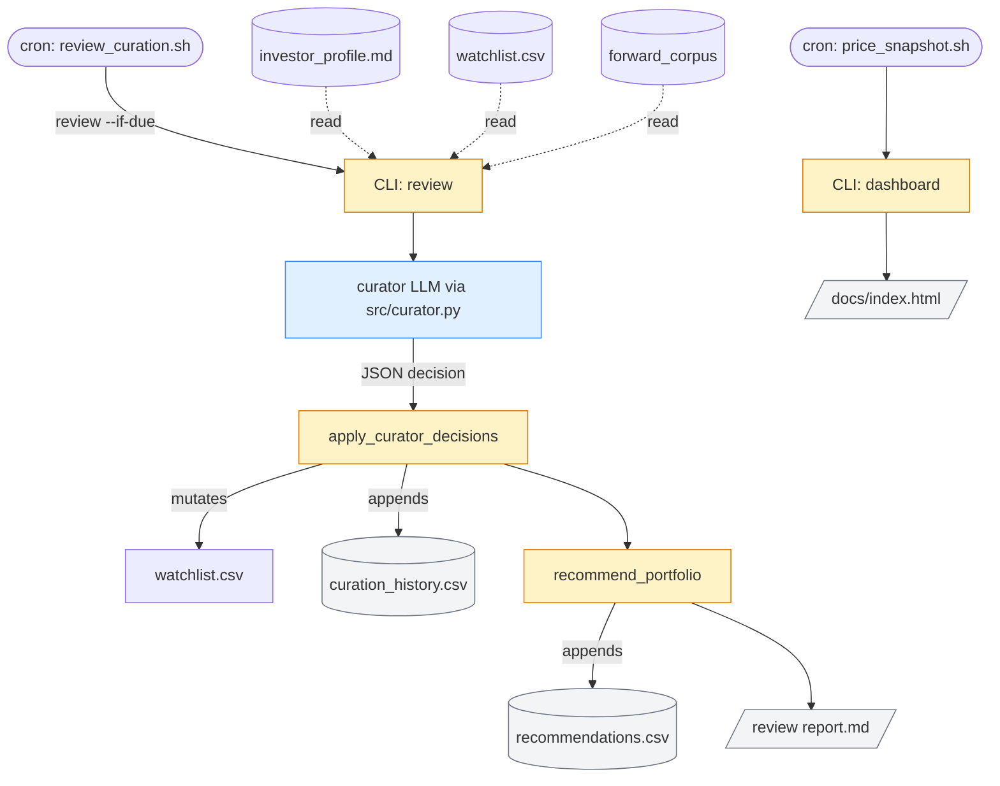

# Reference

CLI flags, repo layout, architecture, and testing instructions for Portfolio Wave Rider. Narrative tour lives in [README.md](README.md); finance terms in [GLOSSARY.md](GLOSSARY.md).

## CLI reference

Nine subcommands (`init-holdings`, `analyze`, `snapshot`, `recommend`, `curate`, `backtest`, `dashboard`, `pull-news`, `review`). The daily crons call `pull-news`, `snapshot`, and `dashboard`; the biweekly cron calls `review --if-due`, which curates, applies, re-optimizes, and writes its report in one process. `analyze`, `curate`, and `backtest` are manual spot-check tools. Every subcommand prints a single JSON blob to stdout.

```bash
# Convert a per-ticker dollar allocation into share counts at today's prices, and
# write both holdings.csv (real shares) and watchlist.csv (the curator universe).
# Use it if you would rather think in dollars than hand-edit holdings.csv.
.venv/bin/python -m src.cli init-holdings --allocations '{"NVDA": 5000, "MSFT": 5000, ...}' --out holdings.csv

# One-shot analysis (fetch prices + compute log-returns + optimize + risk metrics).
# The optimizer always maximizes the mean-variance utility μᵀw - λ·wᵀΣw subject
# to ∑wᵢ=1, wᵢ≥0, and wᵢ≤max_weight. λ (`--risk-aversion`) is the only knob on
# the return/variance tradeoff: small λ favors return (more equity-heavy), large
# λ favors variance reduction (more bond/cash-heavy).
.venv/bin/python -m src.cli analyze --tickers AAPL MSFT NVDA --period 0.5y --max-weight 0.80
.venv/bin/python -m src.cli analyze --tickers AAPL MSFT NVDA --risk-aversion 0.5

# Apply a watchlist-curator JSON payload to watchlist.csv and data/curation_history.csv.
# Validates against the contract (listing date via yfinance, max_watchlist_size,
# no double-adds, no stale removes, blocks removes when shares > 0). Output JSON
# lists applied_adds, applied_removes, and rejections with reasons.
.venv/bin/python -m src.cli curate --input data/curator_latest.json [--as-of-date YYYY-MM-DD] [--no-listing-check]

# Time-series logging
.venv/bin/python -m src.cli snapshot   [--date YYYY-MM-DD] [--force]
.venv/bin/python -m src.cli recommend  [--max-weight 0.80] [--force]

# Pull today's news into data/forward_corpus/ (the daily cron's first step).
# --backfill switches from the live web_search pull to the GKG+Wayback cold start.
.venv/bin/python -m src.cli pull-news [--max-results N] [--backfill --days 21] [--dry-run]

# One rebalance, end to end and in-process: read the trailing news_lookback_days
# slice of the corpus, call the curator, validate and apply its adds/removes,
# re-optimize, and write data/reports/<date>-review-portfolio.md.
# --if-due self-gates to financial_model.rebalance_period (weekly / biweekly /
# monthly / quarterly), so the weekday cron can fire safely and still act only
# once per period. Without it, the review runs unconditionally.
.venv/bin/python -m src.cli review [--if-due] [--as-of YYYY-MM-DD] [--model ID] [--dry-run]

# Math-only walk-forward backtest of a fixed watchlist. Default window is a rolling
# 12 months ending today (yfinance silently clips to whatever trading day has data).
# Writes data/backtest/{snapshots, recommendations}.csv plus report.md to data/backtest/.
.venv/bin/python -m src.cli backtest [--start-date YYYY-MM-DD] [--end-date YYYY-MM-DD] \
                                     [--initial-usd 50000] [--benchmarks SPY DIA QQQ]

# Curator-driven walk-forward backtest: same as above but consumes a directory of
# pre-collected watchlist-curator JSON payloads (one per rebalance date) plus a
# _starter.json config. Replays each payload through the curate + analyze loop, and
# computes a buy-and-hold-of-starter baseline for comparison. Writes snapshots.csv,
# recommendations.csv, baselines_totals.csv, curation_summary.json, and report.md
# to the out_dir.
.venv/bin/python -m src.cli backtest --curator-runs-dir data/curator_runs/5y-sweep-cap08 \
                                     --out-dir data/backtest_curator_5y

# Static dashboard. Default writes docs/index.html (the live portfolio).
# --curator-backtest-dir switches to the curator-backtest dashboard at
# docs/backtest_curator.html: two charts (equity-curve race + watchlist Gantt
# over time) plus a curation event log.
.venv/bin/python -m src.cli dashboard [--benchmarks SPY] [--out docs/index.html]
.venv/bin/python -m src.cli dashboard --curator-backtest-dir data/backtest_curator_5y \
                                       --curator-runs-dir data/curator_runs/5y-sweep-cap08
```

To inspect a math-only backtest visually without auto-render, point the dashboard at the backtest CSVs:

```bash
.venv/bin/python -m src.cli dashboard \
  --snapshots data/backtest/snapshots.csv \
  --recommendations data/backtest/recommendations.csv \
  --out data/backtest/dashboard.html
```

## Layout

```
portfolio-wave-rider/
├── investor_profile.md         # source of truth (you write this; gitignored)
├── investor_profile.example.md # template to copy
├── holdings.csv                # ticker,shares -- your REAL positions (you maintain this; gitignored)
├── watchlist.csv               # ticker -- curator-managed optimizer universe (auto-written; gitignored)
├── holdings.example.csv        # template to copy
├── news_sources.md             # optional curated sources per wave bucket
├── README.md                   # narrative tour + headline result
├── REFERENCE.md                # this file: CLI, layout, architecture, testing
├── GLOSSARY.md                 # finance and stats terms
├── CLAUDE.md                   # rules for Claude operating in this repo
├── .claude/
│   ├── agents/                 # prompt files, NOT spawned subagents
│   │   ├── watchlist-curator.md  # the curator system prompt, read by src/curator.py
│   │   └── report-writer.md      # legacy report format spec, read by nothing
│   └── settings.json           # tool allowlist
├── src/
│   ├── portfolio.py            # all math
│   └── cli.py                  # one CLI, seven subcommands
├── scripts/
│   ├── setup_curator_run.py    # creates a curator runs dir + _starter.json
│   ├── compute_backtest_dates.py  # rolling-5y date diff for backtest refreshes
│   ├── post_date_events.py     # chronological event timeline; suppression list for as-of-date backtests
│   ├── replay_watchlist.py     # replays curator JSONs to compute the watchlist at any as-of date
│   ├── sweep.py                # parameter sweeps for risk_aversion / lookback / concentration_cap
│   ├── sweep_watchlist_size.py # aggregates per-cap _backtest dirs into the cap-sweep page
│   ├── walk_forward.py         # robustness check: are sweep winners stable across halves of the window?
│   ├── run_sweeps.sh           # convenience runner for the three replay sweeps
│   ├── price_snapshot.sh        # cron entry: snapshot + dashboard, logs to data/snapshot.log
│   ├── install_cron.sh         # idempotent installer for the cron entry
│   └── autopush_docs.sh        # auto-pushes docs/ when cron updates docs/index.html
├── tests/
├── data/                       # gitignored except curator_runs/ and backtest_curator_*/
│   ├── snapshots.csv           # daily, appended (your history)
│   ├── recommendations.csv     # appended on each recommend run (your history)
│   ├── curation_history.csv    # appended on each curate run (your history)
│   ├── thesis_baseline.json    # day-0 allocation; anchors the live + forward dashboards
│   ├── curator_latest.json     # most recent live curator output
│   ├── curator_runs/           # one subdir per curator backtest run + a live/ archive
│   │   ├── 5y-sweep-cap08/       # canonical 5y backtest JSONs (cap=8, committed)
│   │   ├── 5y-quarterly/         # cap=12 historical record from before the default migration
│   │   ├── 5y-sweep-cap{05,16,24}/  # max_watchlist_size sweep variants
│   │   └── live/                 # one JSON per live `review` run
│   ├── backtest/               # output of math-only `cli backtest` runs (gitignored)
│   ├── backtest_curator_5y/    # output of the curator-driven 5y backtest (committed)
│   ├── reports/                # LLM-written reports (gitignored)
│   └── *.log                   # cron output (gitignored)
└── docs/                       # GitHub Pages publishing root
    ├── index.html                       # live dashboard (regenerated daily by cron)
    ├── backtest_curator.html            # 5y curator-backtest dashboard
    ├── sweep_risk_aversion.html         # λ sweep
    ├── sweep_lookback.html              # lookback-period sweep
    ├── sweep_concentration_cap.html     # concentration-cap sweep
    └── sweep_max_watchlist_size.html    # max_watchlist_size sweep
```

## Outputs

| File | What's in it | When to look |
|---|---|---|
| `docs/index.html` | Plotly charts of the live portfolio. Regenerated by cron after each daily snapshot. | Open in a browser any time |
| `docs/backtest_curator.html` | Curator-backtest dashboard: six charts — equity-curve race, 90-day rolling Sharpe, watchlist Gantt over time, per-holding $ gain, $ by asset class, $ by wave. | One-off; refresh by re-running `dashboard --curator-backtest-dir` |
| `data/snapshots.csv` | Long-format daily snapshots (date, ticker, shares, price, value, total_value). | Raw price/share history |
| `data/recommendations.csv` | Long-format optimizer output (date, ticker, weight, return, vol, Sharpe, objective). One row block per recommend run. | Raw weight history |
| `data/curation_history.csv` | One row per applied add or remove: date, action, ticker, wave_bucket, rationale, news_evidence_urls. | Audit trail of watchlist composition over time |
| `data/curator_latest.json` | Most recent curator JSON return (overwritten each live `review` run). | Latest curator decisions + evidence |
| `data/curator_runs/<run_id>/*-curation.json` | Per-rebalance archive of curator outputs from backtest runs and live runs. | Forensic re-read; replay input to `backtest --curator-runs-dir` |
| `data/backtest_curator_5y/report.md` | Headline curator-backtest numbers (curator vs both baselines vs SPY, max drawdown, weight stability). | After re-running the 5y replay |
| `data/reports/YYYY-MM-DD-review-portfolio.md` | Narrative report written by `cli review`. | After each review run |
| `data/snapshot.log` | cron stdout/stderr. | If a scheduled run looks missing |

Note: when a ticker leaves the universe (removed from `watchlist.csv` by the curator, or sold out of `holdings.csv`), historical rows in `data/snapshots.csv` and `data/recommendations.csv` are not pruned, so old charts still render correctly. No new rows accumulate for the removed ticker going forward.

The "Profile conflicts" section of any report is the most important thing to read. It tells you when the optimizer wanted something the profile forbids.

## How it's built

The diagram below shows the `cli review` flow, the recurring path that fires once per rebalance (`scripts/review_curation.sh`, self-gated by `--if-due`). Everything inside `review` runs in-process: read the corpus slice, call the curator, validate and apply its decisions, re-optimize, write the report.


```mermaid
flowchart TD
    cron([cron: review_curation.sh]) -->|review --if-due| review[CLI: review]
    profile[(investor_profile.md)] -.read.-> review
    watchlist[(watchlist.csv)] -.read.-> review
    corpus[(forward_corpus)] -.read.-> review
    review --> curator[curator LLM via src/curator.py]
    curator -->|JSON decision| apply[apply_curator_decisions]
    apply -->|mutates| watchlist_w[watchlist.csv]
    apply -->|appends| history[(curation_history.csv)]
    apply --> recommend[recommend_portfolio]
    recommend -->|appends| recs[(recommendations.csv)]
    recommend --> report[/review report.md/]
    snapcron([cron: price_snapshot.sh]) --> dash[CLI: dashboard]
    dash --> idx[/docs/index.html/]

    classDef agent fill:#e1f0ff,stroke:#3b82f6
    classDef cli fill:#fef3c7,stroke:#d97706
    classDef file fill:#f3f4f6,stroke:#6b7280
    class curator agent
    class review,apply,recommend,dash cli
    class report,idx,history,recs file
```

One LLM call (blue) sits inside a chain of Python steps (yellow). The profile is the source of truth; the curator decides composition; the optimizer decides weights.

- **No Claude-Code skills or subagents.** `.claude/skills/` is gone; the flows that used to be slash commands (`/initialize-portfolio`, `/review-portfolio`, `/run-backtest`, `/sweep-max-watchlist-size`) are now CLI subcommands and cron scripts. Nothing in the pipeline needs a Claude Code session.
- The curator LLM is called from **one place**, `src/curator.py`, by both the forward loop and the backtest, so a prompt or parsing change lands on both. It routes `claude-*` model ids to the Anthropic SDK and `vendor/model` ids to OpenRouter, parses the JSON decision, retries transient errors, and falls back to `no_changes`. The model is per-path, set in `investor_profile.md`: `claude-sonnet-5` on the live forward path (`forward.curator_model`), the cheaper `kimi-k2.5` for backtest replays and sweeps (`backtest.curator_model`). Because one prompt and one validator serve both paths, a lesson learned on either side lands on the other.
- `.claude/agents/watchlist-curator.md` is still live, but as a **prompt file**, not a subagent: `src/curator.py` reads it as the curator's system prompt. `.claude/agents/report-writer.md` is legacy and read by nothing.
- Python lives in `src/` (`portfolio.py` math, `cli.py` entry point, `curator.py` LLM call, `retriever.py` news pull, `corpus.py` storage) plus the `scripts/` helpers and cron shims.
- The user-authored `investor_profile.md` is the source of truth. Every recommendation cites lines from it. When the optimal numerical answer violates a profile constraint, the report flags the conflict in a dedicated section; it does not silently clamp.

## API keys

The README covers the two `.env` keys. The rest:

- **`gcp-key.json`**, a BigQuery service-account key file, is read from the repo root by path (`scripts/gkg_pool.py`), not through the usual `GOOGLE_APPLICATION_CREDENTIALS` environment variable. No news corpus is committed to the repo, so a fresh clone must rebuild it from GDELT-GKG before any backtest can run, and that rebuild is what needs this key. The live forward loop does not.
- The `.env` readers (`src/curator.py`, `src/retriever.py`, `scripts/backtest_sdk.py`, `scripts/judge_curations.py`) are plain line parsers, so quotes and an `export` prefix would be read as part of the value.
- Nothing reads keys from the shell environment, so cron inherits nothing and needs no export line. Rotating a key means editing the one value in `.env`.
- Both `.env` and `gcp-key.json` are listed in `.gitignore` under "personal data, never push".

## The optimizer

`portfolio.optimize_portfolio` solves the mean-variance problem with SLSQP: maximize `μᵀw − λ·wᵀΣw` subject to `∑w = 1` and `0 ≤ wᵢ ≤ concentration_cap`. `μ` and `Σ` come from `compute_returns`, which annualizes the mean and covariance of daily log returns by 252 over the trailing `optimizer_lookback_days` window. Three other objectives exist in the code (`max_sharpe`, `min_variance`, `target_return`) but the live and backtest paths both use `mean_variance`; `risk_free_rate` enters only the reported Sharpe, not the objective.

One profile knob is **backtest-only**: `min_trade_size_frac` suppresses any rebalance smaller than that fraction of portfolio value, so a walk-forward run does not churn on noise. `curator_backtest` applies it (`_rebalance_with_min_trade`); the live `recommend_portfolio` never does, because it emits target weights rather than executing trades.

## The curator

The prompt, the routing, and the JSON parser all live in [`src/curator.py`](src/curator.py); the system prompt itself is `.claude/agents/watchlist-curator.md`. The curator returns a decision payload and writes nothing.

`portfolio.apply_curator_decisions` is what validates that payload, and only the changes that survive reach `watchlist.csv` and `data/curation_history.csv`:

- **US-listed only**, with a listing-date check via yfinance, so a backtest cannot add a ticker that had not yet listed on the as-of date.
- **Post-change watchlist size within `max_watchlist_size`.** Anchors are excluded from the count.
- **No double-adds** (a ticker already on the watchlist) and **no stale removes** (a ticker that is not on it).
- **Anchors are protected**: the profile's `always_include` tickers cannot be added or removed by the curator.
- The backtest sandbox additionally **blocks removing a ticker with shares > 0**. That rule does not apply on the live path, where the optimizer universe (watchlist ∪ held) keeps a dropped-but-held ticker recommendable for sale.

Every rejection comes back with a reason, and the applied adds and removes are appended to `data/curation_history.csv`.

## Retrieval engines

Staged here until it gets its own doc. The README deliberately keeps the backtest-vs-forward retrieval split out of the tour.

Both paths read the same `retrieval_config.json`: `wave_keywords` (per-wave phrases that surface an article), `org_stoplist` (non-company entities to drop), and `engine` (two GKG-only guards, `ontopic_offset` and `max_scan_gb`, a BigQuery cost cap). What differs is how the keywords are used.

- **Historical (backtest, bootstrap)**: `GkgWaybackRetriever` in `src/retriever.py`, wrapping `scripts/gkg_pool.py` + `scripts/news_pool.py`. GDELT's GKG table in BigQuery discovers the date-honest article list, matching the keyword regex against article titles and URLs, then Wayback supplies each article's as-of lede so the curator only ever sees text that existed on the decision date. A title-gated live fetch fills Wayback misses (`backtest_sdk._apply_live_fallback`), which carries some look-ahead risk and is tagged as such. Because BigQuery is queried with the keyword regex, changing `wave_keywords` requires a re-ingest before the backtest reflects it.
- **Forward (daily live pull)**: `WebSearchRetriever` in `src/retriever.py` turns each wave's keywords into a fixed `web_search` query, run through a cheap model with no discretion (`retrieval_model` in the profile's `forward` section), and trafilatura extracts each article's full text at pull time. No look-ahead risk, since as-of is today.
- `GkgWaybackRetriever` is also the cold-start backfill for the forward corpus (`cli.py pull --backfill`), which is how the bootstrap corpus was seeded with a trailing window before the daily cron took over.

## The curator backtest

The headline experiment behind the curator design. See [docs/backtest_gkg_3yr_kimi.html](https://joehahn.github.io/portfolio-wave-rider/backtest_gkg_3yr_kimi.html) for the rendered result.

> **Stale below.** The optimizer config, the decision narrative, and the results table in this section describe an earlier weekly run at a different starter watchlist. The dashboard is authoritative; this prose is pending a refresh.

- **Window**: 2023-07-22 to 2026-07-22 (3 years, biweekly, 79 curation calls and 82 rebalances in the current run). Set in `investor_profile.md`'s `backtest` section (`start_date` / `end_date`), with the cadence from `financial_model.rebalance_period`.
- **Starter watchlist**: AAPL, MSFT, GOOGL, NVDA, SPY, a realistic tech-savvy investor's holding.
- **Optimizer (one config)**: mean-variance `λ=2.0`, 30-day price lookback, `concentration_cap=0.80`, weekly cadence, `max_watchlist_size=5`, plus the three permanent `always_include` anchors SPY / AGG / IAU. All from `investor_profile.md` (`financial_model` plus the top-level `concentration_cap`). The same config drives the live recommend path and the backtest.
- **Curator**: kimi-k2.5 (`backtest.curator_model` in the profile), run with `--no-reasoning` via OpenRouter, one call per week. Each call reads a date-clean **GKG plus Wayback** news pool (see the retriever section) instead of live WebSearch, so it only ever sees period-correct news. A full 157-week curate costs about $1.60.
- **Decisions**: kimi was disciplined, making only four swaps across 157 weeks, every ticker real and US-listed. It added RKLB (rockets, on a 2024-05 Space Force catalyst), LMT (defense, 2024-05), CEG (nuclear, 2024-10, the Microsoft / Three Mile Island restart), and re-added GOOGL as a quantum name (2024-12, the Willow chip). It removed GOOGL, AAPL, and LMT over the run, and tried to remove the SPY anchor (rejected by the validator). It held NVDA and MSFT from the starter throughout.

| Strategy | Total return | Notes |
|---|---|---|
| **Curator** (kimi; cap 0.8, λ 2.0, 30-day lookback, weekly) | **+957%** | about +120%/yr, 29% max drawdown, ends RKLB 60% / NVDA 40% |
| Buy-and-hold starter (equal-weight, then hold) | +217% | includes NVDA |
| SPY benchmark (rebased) | +85% | same start |

The curator beat the buy-and-hold investor by about **+740 percentage points**, or **3.4x** its gain. NVDA is in the starter, so the curator gets no credit for the obvious AI winner; the lift comes from its thematic adds and the optimizer's weekly re-weighting.

**Where the return comes from.** Attributed by the wave the curator held each name under at each date (the dashboard's time-aware split), the gain is roughly rockets (RKLB) +$340K, AI (NVDA and MSFT) +$80K, quantum (GOOGL) +$74K, and geopolitical (LMT) +$7K, with nuclear (CEG) about -$7K and the cashlike anchors about -$12K of drag. Rocket Lab alone is about 71% of the gain, so the headline rests on one position.

**Safe-haven anchors.** The optimizer's universe always includes SPY (equity), AGG (bonds), and IAU (gold), set via the profile's `always_include` key and sitting outside the curator's `max_watchlist_size` budget. At this return-hungry config they draw little weight and net a small drag (about -$12K), so they leave the drawdown essentially unchanged. A forced floor, a lower cap, or a higher `λ` would be needed to make them an actual downside buffer.

**Execution lag.** The replay models the gap between a rebalance signal (decided at that date's close) and the trade landing later, since a live user runs a review and only acts afterward. The flag `--t-update-days` (default 1 session, also in the profile's `backtest` section) sets the lag in trading days. The one-time initial capital deployment is not lagged.

**What the clean retriever fixes, and what it does not.** Moving from live WebSearch to the date-honest GKG plus Wayback corpus removes the *retrieval* leak: at a 2023 as-of date the curator can no longer surface a 2026 "best stocks to buy" list, and it only cites articles that carried a period-correct date (server-enforced GKG date bounds plus archived same-date ledes). This is the same hardening the sibling [geo-herd-rider](https://github.com/joehahn/geo-herd-rider) project uses. It does **not** remove the deeper leak: the curator is an LLM whose training postdates the window, so at a 2024 as-of date it may already know that rockets and nuclear won. The candidate selection carries that prior even when no post-date fact is cited, and the one bet that drove the result (RKLB) is exactly the pick most exposed to it. So the backtest stays a hindsight-tinted upper bound, not a clean out-of-sample result, and with a single dominant bet (n=1) it cannot separate skill from luck.

**Forward testing (the only real check).** Hold this config fixed and measure realized performance on rebalances that postdate the model's training cutoff, where the outcomes were genuinely unknowable when decided. Operationally, extend the `backtest` window's `end_date` forward (only the new dates fire, existing curation JSONs are untouched), or compare the live `/review-portfolio` track record against the backtest's expectation. Setting **`forward_split_date`** in the profile's `backtest` section (or `--forward-split-date`) splits `report.md` and the dashboard into an in-sample segment (rebalances on or before the date) and an out-of-sample segment (after it), reporting the curator return, buy-and-hold return, and lift for each. It is reporting only and never touches the optimizer math. If the out-of-sample edge holds near the in-sample edge, the curator adds real signal; if it collapses toward buy-and-hold, the in-sample result was hindsight. This is the next phase of the project.

To reproduce, replay the saved curations through the optimizer (a few seconds, no LLM) and rebuild the dashboard:

```bash
python -m src.cli backtest --curator-runs-dir data/curator_runs/gkg-3yr-kimi \
    --out-dir data/backtest_curator_gkg_3yr_kimi --benchmarks SPY
python -m src.cli dashboard --curator-backtest-dir data/backtest_curator_gkg_3yr_kimi \
    --curator-runs-dir data/curator_runs/gkg-3yr-kimi --curator-model moonshotai/kimi-k2.5 \
    --out docs/backtest_gkg_3yr_kimi.html
```

The optimizer knobs default to the live config in `investor_profile.md`; pass `--max-weight` / `--risk-aversion` / `--lookback-years` only to test a different candidate. Re-curating from scratch (fresh `watchlist-curator` calls via `scripts/backtest_sdk.py`) costs about $1.60 in kimi tokens.

### Prior wave-stage tilt experiment (frozen on `5y-backtest` branch)

The previously-attempted design (LLM classified each technology wave's cycle stage and tilted μ accordingly) didn't survive multi-year backtests: AI tilts subtracted **−2.5%** to **−4.6%** of final value across the same 5y window. Postmortem and preserved artifacts on the [`5y-backtest`](https://github.com/joehahn/portfolio-wave-rider/tree/5y-backtest) branch in `FINDINGS.md`. Three things the tilt design got wrong: granularity (per-wave bucket too coarse — NVDA news ≠ GOOGL news), cadence (quarterly too slow for news with days-long half-life), and magnitude (±20% multiplier mis-calibrated). The curator design sidesteps all three by making the LLM's job a coarse-grained add/remove decision rather than a continuous numerical tilt.

### GBTC inclusion experiment (rejected)

Tested whether putting GBTC (the spot-BTC trust, full 2021→2026 price history) in the starter watchlist alongside `[AAPL, MSFT, GOOGL, NVDA, SPY]` would lift returns. It hurts (this ablation was run at `t_update_days=0`, so its baseline is the +1259.13% / $679,564 same-close run): final value drops from $679,564 to $356,595, annualized return from +68.5% to +48.1%, and max drawdown widens from −45.6% to −60.2%. The story is timing risk on the optimizer's 1.5y lookback — at 2021-03-31 it loaded 61% GBTC off the 2020 rally, was still at 47% GBTC heading into the 2022 crash, and reloaded to 70% GBTC at 2025-01-02 after the 2024 recovery showed up in the trailing window. BTC's high volatility plus its two large drawdowns in this window make it a momentum trap for a mean-variance optimizer with a 1.5y memory. Crypto can be added by an individual user who wants it (declare a "digital assets" wave in `investor_profile.md` and the curator will weigh it on its own merits); it's not in the default demo.

## Automation (cron, cross-platform)

One cron entry handles daily price snapshots and dashboard refresh. Install with:

```bash
./scripts/install_cron.sh
```

The helper appends one line to your crontab (preserving anything else there) that fires `scripts/price_snapshot.sh` Mon-Fri at 16:30 local. Works the same on macOS and Linux. Both scripts resolve their own location, so there's no `PROJ` variable to maintain. `install_cron.sh` is idempotent (re-running is safe). To uninstall: `crontab -e` and delete the matching line.

Each fire runs `snapshot` then `dashboard`, appending timestamped output to `data/snapshot.log`. cron only fires while the machine is awake; missed runs do not auto-replay. Use `--date YYYY-MM-DD` on `snapshot` to backfill a missed day.

The cron refreshes `docs/index.html`. The file is git-tracked but cron does not push — `git status` will show it modified after each run, and a manual `git add docs/index.html && git commit && git push` publishes the refresh.

## Testing

```bash
.venv/bin/pytest tests/    # offline; no network calls, no API keys needed
```

Tests are pure-Python: synthetic price series → returns → optimizer → risk metrics → curator validation → curator-backtest replay. Network-dependent code paths (yfinance, agent calls) are not exercised in CI.

## Things to watch

- **Sample bias.** The realized Sharpe on a 1-2 year window is usually optimistic vs the forward-looking distribution. Returns are non-stationary; vol clusters; means are noisy.
- **Estimation error in `μ`.** Mean-variance amplifies small errors in the expected-return estimate. A weight pinned at the concentration cap is often a symptom of estimation noise, not a real signal. This is the well-known Markowitz blow-up. Run `python -m src.cli backtest` to walk the optimizer forward on real historical data; if the weight-stability L1 metric is small (~0.02 means weights barely move week to week) the estimation noise isn't driving the solution.
- **Curator hindsight risk in backtests.** When the curator runs against a historical as-of date, its job is to use only information available at that date. The agent spec enforces this with a persona reset, WebSearch `before:` filters, a suppression list of post-date events, and a self-critique pass, but the discipline is best-effort, not airtight. Sample a few of the cited evidence URLs against their dates before trusting a backtest's headline number.
- **Numbers come from Python.** If a figure in a report did not come from `src.cli`, that's a bug. The LLM is allowed to write prose; it is not allowed to do arithmetic.

## Roadmap

The next build is one sequenced design, the **escalator scout layer**, named after the project's own metaphor: tickers are escalators that rise, sit flat, or fall over time, and the job is to board the accelerating ones and rotate off the decaying ones. The goal is a measured lift over the current curator+MVO 5y baseline (+1267% realized). Lightweight specialist *scouts* each score every ticker on one leading indicator, a *combiner* fuses the scores into a ranking, the top N go to a turnover-penalized mean-variance optimizer, and the LLM still never touches a final number. The scout layer sits between the curator (which decides *which* escalators exist in the universe, on a slow news-driven clock) and the optimizer (which sets dollar weights). The two places the lift can come from are signal *diversity* (primary-source facts the news-only curator misses) and *timing* (a momentum rank that boards accelerating names and rotates off decaying ones faster than the quarterly curator can). Each step lives on an experimental branch and races the baseline walk-forward before touching the live flow.

1. **Momentum scout + turnover-penalized MVO.** The smallest change with the fastest read on whether timing alone beats the baseline, pure Python, no new dependencies. The curator widens the universe (cap 30-50); a volatility-adjusted trailing-return score (per-ticker `mean(r)/σ(r)` over a tunable lookback, the "escalator speed") ranks them and picks the top N; mean-variance weights those N with an L1 turnover penalty so the optimizer pays a cost to churn positions (the one genuinely-sequential win, captured convexly instead of with RL). Sweep the lookback walk-forward, 3-12 month formation windows are the documented cross-sectional-momentum anomaly, same hygiene as the concentration-cap sweep. A proof-of-concept of the `momentum_score` / `rank_by_momentum` primitives plus the opt-in `turnover_penalty` optimizer param is prototyped on a parked local branch (`escalator-scout-step1`), default off so existing flows are untouched.

2. **One primary-source scout: EDGAR Form 4 insider buys.** Add a second scout reading a primary source the news-only curator misses. SEC EDGAR is free, official, and API-accessible; insiders buying their own stock is one of the few documented informative filing signals. Emit a per-ticker score, measure whether fused picks beat momentum-alone. USASpending.gov contract awards (space / nuclear / quantum waves) and Kalshi prediction-market probabilities (macro regime context) are the next two scouts in line; add one at a time and measure each.

3. **Learned combiner: pooled cross-sectional return model.** Once two or more scouts exist, learn how to weight them. Supervised regression on the (ticker, month) panel, scout scores as features predicting forward *relative* return (demeaned per date), trained across a wide universe with time-blocked, embargoed validation. This is the honest version of the "RL across ticker batches" idea: batches of tickers are not independent games because they share one macro history, and since holding a stock doesn't change its future returns the Q-function degenerates to a regression, so use a regressor. Survivorship bias in yfinance ticker lists is the main data risk and gets a haircut in any headline number.

**Why not RL.** A full PPO / Gymnasium / Stable-Baselines3 design was scoped and rejected as overkill for this retail use case, where the investor's trades do not move the market. The problem decomposes cleanly: the *prediction* half (which escalator rises) has no action-to-state feedback, so the Q-function degenerates to a regression, use a regressor (step 3); the *control* half (when to trade given costs and a risk budget) is genuinely sequential but **convex**, so a turnover-penalized mean-variance optimizer solves it deterministically (step 1), no policy network and no sampling. RL would only earn its complexity under conditions none of which hold here: market impact at institutional size (trades move prices), non-convex frictions (multi-period tax-lot or combinatorial constraints), or many independent training episodes (we have one macro history).
